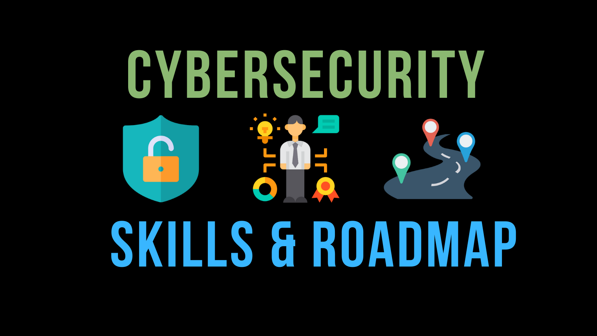

# Cybersecurity Skills and Career Roadmap
Skills and Career Roadmap for Cybersecurity Professionals.

Either you are planning or already into this domain, you can use this as your  reference for various skill sets, job details, security concepts and general guidance.
We will cover what are the skill sets, learning resources, job titles available, JDs etc. for cybersecurity folks.
Cybersecurity covers all the security branches at present, so I would mention cybersecurity or security in this repo time to time.

>Always remember no one is perfect and learning and unlearning every single day is the key for the success. 
Although in security domain what you need more is the patience and never give up attitude.

**This github repo will cover below items:**
1. [Security concepts one should be aware](security-concepts.md)
2. [Common Technical skills one should learn](common-skills.md)
3. [Web Security skill sets](web-security.md)
4. [Network Security skill sets](network-security.md)
5. [Software Security](software-security.md)
6. [Cloud Security skill sets](cloud-security.md)
7. [Container Security skill sets](container-security.md)
8. [DevSecOps skill sets](devsecops.md)
9. [Security Interview Questions](https://github.com/jassics/cybersecurity-interview-questions) - Another Fantastic Github Repo
10. [Various Security Job Role and required skill sets](security-job-roles.md)
11. [JDs for different cybersecurity skills](/JDs)

**Note:** I am not adding mobile security, AI/ML Security, IoT security, Blockchain Technologies etc. But we can add if someone is interested to contribute on these topics as well.

If you think there's something that should be improved here, **_please [create an issue](issues/new)._**

## General Guidance
1. **Ask**: The simplest way to excel in the security domain is ask for guidance whenever you have any doubt(s), but do your homework well before asking and don't encourage spoon feeding please.
2. **Learn, make important notes and share**:  Learning is as important as brisk walking to your health. Keep yourself always updated, keep learning, make notes online/offline. And don't forget to share your learnings to make others also learn from people like you through blog, video, social media share whatever is easy for you.
3. **Join security community newsletter**: You cannot learn everything from every corner, so better subscribe to weekly/monthly security newsletter and be updated in that specific security topic/domain
4. **Try to teach**: If you want to understand something with clear mind, then try to teach that topic. You would learn a lot while preparing for that topic and would get good exposure in security community too. Present the topic in various security talks/conferences etc. Null chapter is the good place to start with.
5. **Don't hesitate to buy books, it's the best investment**: I still see people look for fre materials. I am not saying its bad, but would you work for free even for an hour? No right? So, if someone has spent time to author the book or tutorials, try to appreciate their efforts by buying it whenever possible for you.
    I would suggest to buy some important printed books which you would feel to refer now and then. 
    Like Threat Modeling by Adam Shostack, WAHH by Stuttard Pinto, Secure Code, Real-World Cryptography by Davind Wong
6. **Github can be one way to be updated and share your learnings**: I have observed that majority of security professionals like to share their thoughts or collaborate with other like-minded people through a version control system and github is the most popular one for that. If you are not aware of git and got commands try [My Github Basics course on Udemy](https://www.udemy.com/course/git-basics-for-everyone) (Ask for discount)
7. **Be humble and help others**: With my personal experience I am saying when you are humble and ready to help other you will get help from unknown faces too.That's Karma ;)
8. **Don't look for shortcuts**: Straight no to dumps, proxy interview, proxy certs etc.
9. **Spend some bucks to upgrade your skills**: Update yourself and learn the security concepts, subject etc from various online free or paid sources like youtube, coursera, udacity, acloud.guru, pluralsight, Linkedin Learn
10. **Give credits to the author**:  If you learn something. Say thanks, like, share, comment subscribe whatever can be the way for gratitude.
11. **Get yours hands dirty**: This determines how much technical and in-depth understanding you have for your expertise area. 
Something new comes up, explore it, dig it further and practice in your local machine or in your personal cloud instance.
12. **At last, Never Give up**: Believe me you will need it the most to succeed in this domain. 
There would be time when you would be frustrated and would feel depressed even after giving too much in security. 
Learn not to give up, no matter whatever happens. Because you have chosen it out of your interest or passion, stick to it.

## ToDo List Priority wise
- [x] Update README Page for final version 
- [x] Update Content to Common Skills page
- [x] Cybersecurity Abbreviations
- [x] Cybersecurity Certifications
- [ ] Cybersecurity Terminologies
- [ ] Add Content to Security Concepts page
- [ ] Add Content to Web Security page
- [ ] Add Content to Cloud Security page
- [ ] Add Content to Network Security page
- [ ] Add Content to Software Security page
- [ ] Add Content to DevSecOps page
- [ ] Add Content to Container Security page
- [ ] Add content to Cybersecurity JDs for different job roles and skills required
- [ ] Add JDs for various security skills

## Contributors
[Please refer the guidelines at contribute.md for details](Contribute.md).

Thanks to the following folks who made contributions to this project.

**Get your name listed here**

[List of Contributors](graphs/contributors)