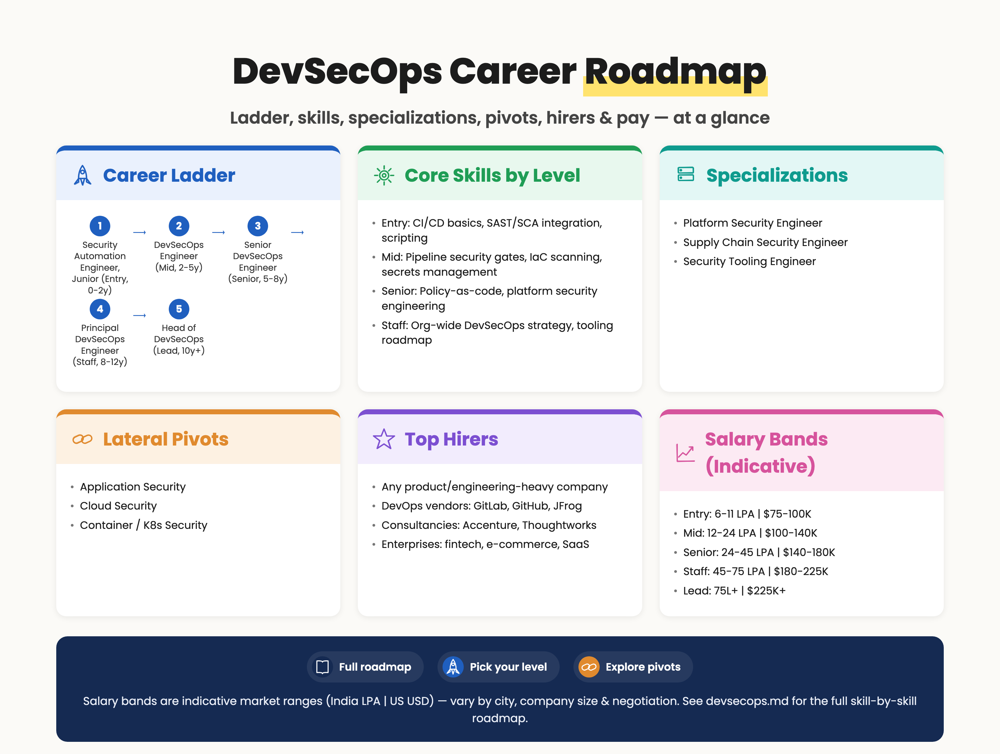
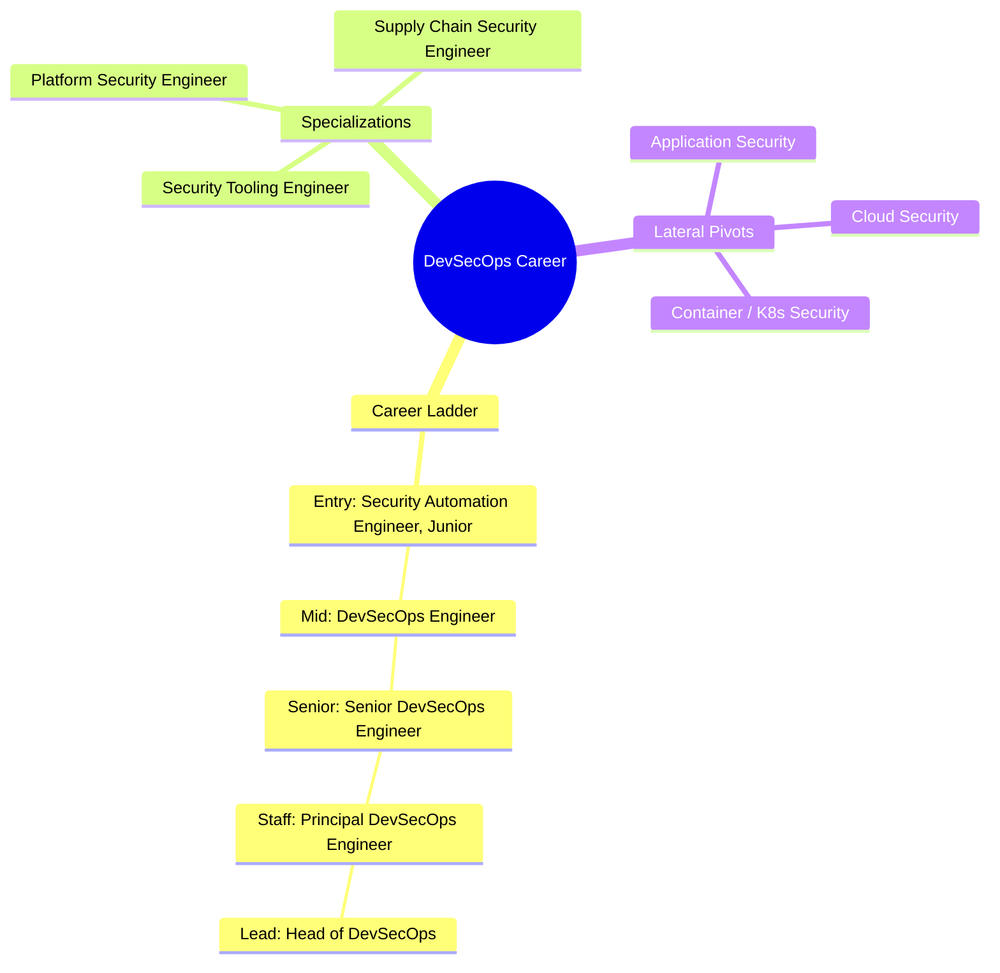

# DevSecOps Skills and Career Roadmap

> 📘 Recommended study plans: [Secure Software Development Lifecycle](https://github.com/jassics/security-study-plan/blob/main/secure-software-development-lifecycle-study-plan.md) · [Product Security](https://github.com/jassics/security-study-plan/blob/main/product-security-study-plan.md) · [Common Skills](https://github.com/jassics/security-study-plan/blob/main/common-skills-study-plan.md).

DevSecOps sits at the intersection of **Dev + Sec + Ops**. You write code, automate pipelines, and embed security checks where developers will actually use them. It's one of the highest-paying tracks in security right now because the skill blend is genuinely rare.


> Salary bands above are indicative market ranges (India LPA | US USD) — vary by city, company size, and negotiation.

<details>
<summary>Branching mindmap (Mermaid — click to expand)</summary>



</details>

## Top hirers (illustrative)
- **Any product/engineering-heavy company**
- **DevOps vendors**: GitLab, GitHub, JFrog
- **Consultancies**: Accenture, Thoughtworks
- **Enterprises**: fintech, e-commerce, SaaS

## Salary bands (indicative — India LPA | US USD, varies by city/company/negotiation)
| Level | India (LPA) | US (USD) |
|-------|-------------|----------|
| Entry | 6–11 | $75K–100K |
| Mid | 12–24 | $100K–140K |
| Senior | 24–45 | $140K–180K |
| Staff | 45–75 | $180K–225K |
| Lead | 75L+ | $225K+ |

## Who is this for?
- Developers who care about security
- DevOps / SRE / Platform engineers moving toward security
- AppSec engineers who want to automate themselves out of repetitive work
- Security engineers tired of "scan-and-throw-over-the-wall" workflows

## Pre-requisites (foundation)
1. Solid coding skills in **at least one** language (Python or Go preferred; JavaScript, Java OK)
2. Git, branching strategies, code review etiquette
3. CI/CD platforms — **GitHub Actions / GitLab CI / Jenkins** (pick one to start)
4. Linux + Docker + Kubernetes basics
5. At least one cloud (AWS / Azure / GCP)
6. IaC — Terraform basics
7. Familiarity with the OWASP Top 10 (you'll be detecting these in pipelines)

## Career ladder

### Entry level (0–2 years)
**Possible job titles:**

- Security Automation Engineer (Junior)
- Associate DevSecOps Engineer
- AppSec Engineer (automation-leaning)
- Cloud Security Engineer (pipeline focus)

**Skills to focus on:**

1. **CI/CD security 101** — secrets in pipelines, runner isolation, branch protections
2. **SAST integration** — Semgrep, SonarQube, CodeQL, Snyk Code, Checkmarx
3. **SCA / dependency scanning** — Dependabot, Renovate, Snyk Open Source, OWASP Dependency-Check
4. **Container scanning** — Trivy, Grype, Docker Scout
5. **IaC scanning** — Checkov, tfsec, KICS
6. **Secret scanning** — gitleaks, trufflehog, GitHub secret scanning
7. **Scripting glue** — Python / Bash / Go to wire scanners together
8. **API basics** — calling SaaS scanner APIs, parsing JSON, posting to Jira/Slack
9. **Defect Dojo or OWASP Dojo** for vuln aggregation

### Mid level (2–5 years)
**Possible job titles:**

- DevSecOps Engineer
- Security Tooling Engineer
- Platform Security Engineer

**New skills to add:**

1. **DAST automation** — ZAP baseline, Nuclei in CI, authenticated scans
2. **Policy as Code** — OPA / Rego, Conftest, Sentinel (HashiCorp)
3. **Pipeline hardening** — SLSA framework, signed commits, signed artifacts (Cosign)
4. **Build provenance & SBOM** — Syft, CycloneDX, SPDX
5. **Kubernetes admission control** — Kyverno / Gatekeeper at scale
6. **Secrets management** — HashiCorp Vault, AWS Secrets Manager, External Secrets Operator
7. **Custom security tooling** — building your own scanners / Burp extensions / Semgrep rules
8. **Threat modeling integrated into design reviews**
9. **Security observability** — emitting metrics on MTTR, scanner coverage, vuln aging
10. **Developer experience (DX)** — make the secure path the easy path

**Certs to consider:**

- [CDP: Certified DevSecOps Professional](https://www.practical-devsecops.com/certified-devsecops-professional/?fpr=jassics)
- [CDE: Certified DevSecOps Expert](https://www.practical-devsecops.com/certified-devsecops-expert/?fpr=jassics)
- AWS / Azure Security cert (cloud is half of DevSecOps)
- CKS for K8s heavy environments

### Senior level (5–8 years)
**Possible job titles:**

- Senior DevSecOps Engineer
- Lead Platform Security Engineer
- Staff Security Engineer (Platform)

**New focus areas:**

1. **Reference architectures** for secure pipelines across the org
2. **Vendor evaluation and consolidation** (CNAPP, SCA, SAST, secrets vaults)
3. **Security guardrails as a service** — paved roads, golden pipelines
4. **Supply chain security strategy** (SLSA Level 3+, in-toto, signed builds)
5. **Cross-team influence** — partnering with eng leadership, SRE, product
6. **Metrics & business reporting** — board-friendly security KPIs
7. **Cost optimization** — picking the right tool per scale

### Staff / Principal (8+ years)
**Possible job titles:**

- Principal DevSecOps Engineer
- Platform Security Architect
- Head of DevSecOps / Engineering Manager - Security Platform

**Focus areas:**

- Org-wide security platform strategy
- Build vs. buy decisions
- Team scaling and developer engagement programs
- Industry contributions (OSS, talks, OWASP)

## Career paths from DevSecOps

```text
                       DevSecOps (entry)
                              │
       ┌──────────────┬───────┴───────┬──────────────┐
       ▼              ▼               ▼              ▼
   AppSec        Cloud Security    Platform Sec   Supply Chain
   Engineer      Engineer           Engineer       Security
       │              │               │              │
       ▼              ▼               ▼              ▼
   Product Sec   Cloud Security  Distinguished   SLSA / SBOM
   Architect     Architect       Platform Eng    Lead
       │
       ▼
  Security Architect ──► Head of Engineering Security / CISO track
```

## Lateral pivots from DevSecOps
- **→ Application Security** — go deeper into code, threat modeling
- **→ Cloud Security** — same toolchain, more infra
- **→ Container / K8s Security** — runtime + admission focus
- **→ SRE / Platform Engineering** — reliability-tinted track
- **→ Engineering Management** — lead the platform sec team

## AI-augmented DevSecOps (you need this in 2025+)
DevSecOps is one of the most AI-leveraged tracks because so much of the work is glue code, triage, and pipeline orchestration.

### Using AI to do DevSecOps better
1. **AI-assisted triage** — use LLMs to summarize SAST / SCA / DAST findings, deduplicate, and route to the right team
2. **Auto-fix PRs** — GitHub Copilot Autofix, Snyk DeepCode, Cursor for fixing simple SAST findings
3. **Custom Semgrep / CodeQL rules** — prompt AI to convert CVE patterns to rules; you validate
4. **Pipeline code generation** — generating boilerplate GitHub Actions / GitLab CI YAML for new repos with the org's mandatory security stages
5. **OPA / Rego authoring** — AI is genuinely good at first-draft policies; you tighten and test
6. **Incident comms / postmortem drafts** — AI writes the first 80%, you fix the last 20%

### Securing AI in CI/CD
GenAI is now part of the SDLC — secure it like any other tool:

1. **Secrets in AI sessions** — developers paste production keys / customer data into Copilot / ChatGPT. Build DLP into the IDE and chat layer.
2. **Hallucinated packages** — "slopsquatting"; pin dependencies, use private registries, enforce signed packages
3. **AI-generated IaC review** — AI-written Terraform / Helm often misses least privilege and encryption defaults
4. **AI agent autonomy** — if a copilot can open PRs, make sure it can't merge or deploy without human review
5. **Model & weight supply chain** — sign and verify models like artifacts (Cosign, ModelScan, Sigstore for models)
6. **AI-BOM** alongside SBOM in your build pipeline
7. **Cost controls** — token budgets, per-team quotas, audit logs for AI service usage

See: [AI Security Career Roadmap](ai-security-career-roadmap.md) · [GenAI Security Study Plan](https://github.com/jassics/security-study-plan/blob/main/genai-security-study-plan.md)

## Recommended tools to master
- **SAST**: Semgrep, CodeQL, SonarQube, Snyk Code
- **SCA**: Dependabot, Renovate, OWASP Dependency-Check, Snyk Open Source
- **DAST**: OWASP ZAP, Nuclei, Burp Suite Enterprise
- **Secrets**: gitleaks, trufflehog, Vault
- **IaC**: Checkov, tfsec, KICS, Terrascan
- **Container**: Trivy, Grype, Docker Scout
- **Policy**: OPA, Kyverno, Conftest
- **Supply chain**: Cosign, Syft, in-toto, SLSA
- **Vuln management**: DefectDojo, Faraday

## Recommended books / resources
- *Securing DevOps* — Julien Vehent
- *Container Security* — Liz Rice
- *Site Reliability Engineering* (Google SRE book — free online)
- [OWASP DevSecOps Maturity Model (DSOMM)](https://owasp.org/www-project-devsecops-maturity-model/)

## Next step
Pick a sample project (any Python/Node app on GitHub), and **build a complete secure pipeline yourself** — SAST + SCA + secret scan + container scan + IaC scan + DAST baseline + SBOM generation. The exercise alone teaches you 70% of what you need at mid-level.
