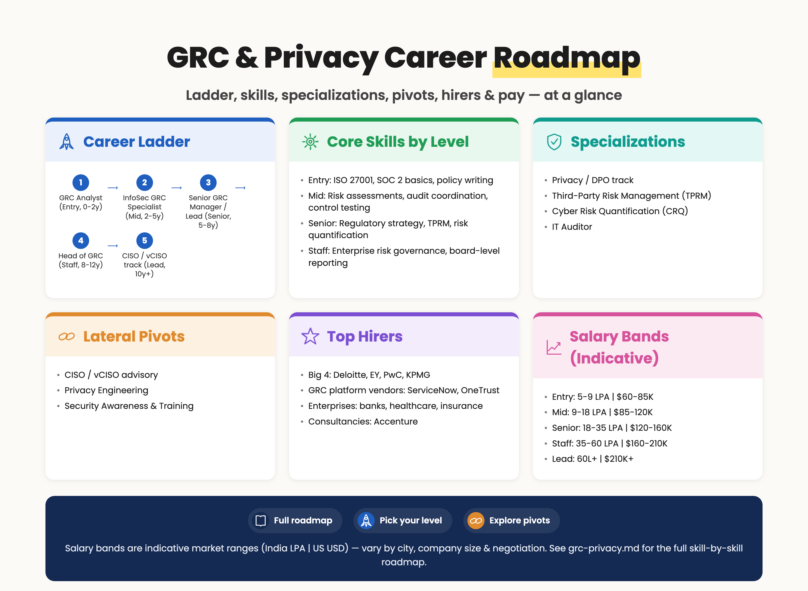
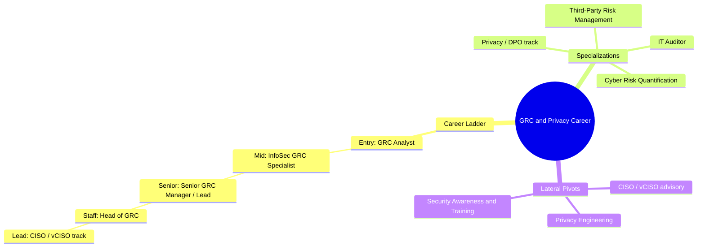

# GRC & Privacy Career Roadmap

> 📘 Recommended study plans: [Common Skills](https://github.com/jassics/security-study-plan/blob/main/common-skills-study-plan.md) · [GenAI Security (for AI governance)](https://github.com/jassics/security-study-plan/blob/main/genai-security-study-plan.md).

GRC stands for **Governance, Risk, and Compliance**. Add **Privacy** to it, and you have one of the most stable, well-paid, business-critical security tracks — especially in regulated industries (BFSI, healthcare, SaaS selling to enterprises). Unlike most other tracks in this repo, GRC is **less code, more language, policy, audit, and risk translation** between security, legal, and the business.

> If you love technical depth and hate paperwork — this is *not* your track. If you love systems thinking, policy, communication, and translating risk to business language — this can be a fantastic, lucrative, long career.


> Salary bands above are indicative market ranges (India LPA | US USD) — vary by city, company size, and negotiation.

<details>
<summary>Branching mindmap (Mermaid — click to expand)</summary>



</details>

## Top hirers (illustrative)
- **Big 4**: Deloitte, EY, PwC, KPMG
- **GRC platform vendors**: ServiceNow, OneTrust
- **Enterprises**: banks, healthcare, insurance
- **Consultancies**: Accenture

## Salary bands (indicative — India LPA | US USD, varies by city/company/negotiation)
| Level | India (LPA) | US (USD) |
|-------|-------------|----------|
| Entry | 5–9 | $60K–85K |
| Mid | 9–18 | $85K–120K |
| Senior | 18–35 | $120K–160K |
| Staff | 35–60 | $160K–210K |
| Lead | 60L+ | $210K+ |

## Who is this for?
- IT auditors, internal auditors looking to specialize in security/privacy
- Lawyers / paralegals moving toward technology
- Consultants from Big 4 (Deloitte, EY, KPMG, PwC) growing in cyber
- Security engineers who want to influence policy/strategy without staying purely technical
- Project / program managers in security

## Pre-requisites (foundation)
1. Understanding of **how a business runs** — finance basics, vendor management, contracts
2. Familiarity with **CIA triad, AAA, common security controls** (access control, encryption, logging, BCP/DR)
3. Knowledge of **at least one framework** end-to-end (start with ISO 27001 or SOC 2)
4. **Risk vocabulary** — threat, vulnerability, likelihood, impact, residual risk, risk appetite
5. Strong **written + verbal English** (or local language for in-country roles)
6. Basic IT literacy — what is a firewall, what is IAM, what is a database (no need to be an expert)
7. Spreadsheet + documentation tooling — Excel, GRC platforms

## Career ladder

### Entry level (0–2 years)
**Possible job titles:**

- GRC Analyst
- Compliance Analyst
- IT Risk Analyst
- Information Security Analyst (GRC track)
- Internal Auditor (Cyber)
- Junior Privacy Analyst

**Day-to-day:**

- Collect audit evidence (screenshots, logs, policies) from engineering teams
- Maintain risk registers
- Track open audit findings to closure
- Support security questionnaires (TPRM, SIG, CAIQ)
- Help draft / update policies and procedures

**Skills to focus on:**

1. **One major framework deeply** — pick ISO/IEC 27001:2022 **or** SOC 2 Type II first
2. **Risk assessment basics** — qualitative and quantitative (high level), NIST 800-30
3. **Control mapping** — same control across multiple frameworks (CIS Top 18, NIST CSF, ISO 27001)
4. **Privacy basics** — what is PII, PHI, PCI data, sensitive vs. confidential
5. **Privacy regulations awareness** — GDPR, CCPA/CPRA, India DPDP Act 2023, HIPAA, LGPD (whichever applies to your geography)
6. **Audit lifecycle** — planning, fieldwork, evidence, findings, remediation, follow-up
7. **Documentation skills** — policy, standard, procedure, guideline differences; writing for non-security audience
8. **Reading SOC 2 reports** — Type I vs Type II, complementary user entity controls (CUECs)

**Entry certs:**

- ISO 27001 Lead Implementer (Foundation)
- CompTIA Security+ (broad security knowledge)
- Certified in Cybersecurity (CC) by ISC2 — entry-level, free for first attempt
- ISACA CGEIT / CRISC (when eligible)

### Mid level (2–5 years)
**Possible job titles:**

- Information Security GRC Specialist
- IT Risk Manager
- ISO 27001 / SOC 2 Lead
- Compliance Manager
- Privacy Analyst → Privacy Specialist
- TPRM (Third Party Risk Management) Specialist
- IT Auditor → Senior IT Auditor

**New skills to add:**

1. **Multiple frameworks fluency** — ISO 27001, SOC 2, NIST CSF, PCI-DSS, HIPAA, HITRUST CSF, FedRAMP basics, RBI guidelines (for India BFSI), DORA (EU finance)
2. **TPRM at scale** — questionnaires (SIG, CAIQ, custom), vendor tiering, continuous monitoring (Security Scorecard, Bitsight)
3. **Risk quantification** — FAIR (Factor Analysis of Information Risk) basics
4. **Policy authorship** — writing policies that engineering will actually follow
5. **Privacy operations** — DPIA / PIA, records of processing activities (RoPA), data subject rights workflows (DSAR)
6. **Cross-border data transfer** — SCCs, BCRs, adequacy decisions; data localization in India / Russia / China
7. **GRC platforms** — Vanta, Drata, Secureframe (startup-friendly); Archer, ServiceNow GRC, MetricStream (enterprise)
8. **Audit committee / management reporting** — dashboards, KRIs, KPIs
9. **Business continuity & DR** — BIA, RTO, RPO, ISO 22301 awareness
10. **Light technical literacy** — read a SOC 2 control test, understand a pentest report, judge if an EDR alert is real

**Certs to consider:**

- **CISA** (Certified Information Systems Auditor) — gold standard for IT audit
- **CISM** (Certified Information Security Manager) — management-oriented
- **CRISC** (Certified in Risk and Information Systems Control)
- **ISO 27001 Lead Auditor / Lead Implementer**
- **CIPP/E, CIPP/US, CIPM, CIPT** (IAPP) — *the* privacy certifications
- **HCISPP** for healthcare
- **PCI ISA** (Internal Security Assessor) for PCI-heavy orgs

### Senior level (5–8 years)
**Possible job titles:**

- Senior GRC Manager / Lead
- Risk Manager / Senior Risk Manager
- Compliance Lead
- Privacy Manager / Senior Privacy Counsel (if legal background)
- DPO (Data Protection Officer) — for some geographies
- Senior IT Auditor / Audit Manager

**New focus areas:**

1. **Enterprise Risk Management (ERM)** — integrating cyber risk into business risk
2. **Risk treatment strategy** — accept/transfer/mitigate/avoid; building business cases
3. **Cyber insurance** — working with brokers, ransomware coverage, sub-limits
4. **Regulatory engagement** — direct conversations with regulators (RBI, SEBI, EU DPA, FDA, etc.)
5. **Crisis communications** during breaches — coordinating with legal, PR, customers
6. **Mergers & Acquisitions due diligence** (cybersecurity portion)
7. **Building a GRC program from scratch** — for a startup or new business unit
8. **AI Governance** (emerging) — ISO/IEC 42001, NIST AI RMF, EU AI Act, India DPDP-AI overlap

### Staff / Principal / Leadership (8+ years)
**Possible job titles:**

- Head of GRC
- Director of Risk & Compliance
- Chief Privacy Officer (CPO)
- Data Protection Officer (DPO) — senior, often C-1
- VP Compliance
- vCISO / Fractional CISO (consulting track)
- CISO (one common path to CISO is via GRC)

**Focus areas:**

- Multi-jurisdiction regulatory strategy
- Board-level reporting and risk communication
- Building and scaling teams (GRC analysts, auditors, privacy)
- Vendor strategy across GRC tooling stack
- Industry influence — ISACA chapters, IAPP, OWASP committee work

## Specialization branches

### Privacy (deep specialization)
- DPO track requires legal-tech hybrid skills
- CIPP/E + CIPM + CIPT trifecta opens doors globally
- Strong career growth — every digital business needs this now

### Third-Party Risk Management (TPRM)
- Specialization in vendor / supply chain risk
- Tools: OneTrust Vendorpedia, Prevalent, ProcessUnity, Bitsight, SecurityScorecard
- Heavy questionnaire and contract review work

### Cyber Risk Quantification (CRQ)
- FAIR Institute methodology
- Tools: RiskLens, Safe Security, Axio
- Bridges security and finance

### IT Audit
- Sub-track of GRC; CISA-centric
- External audit (Big 4) vs. internal audit careers

### Regulatory specialist
- Sector-specific: BFSI (RBI, SEBI, OCC, FFIEC, DORA), Healthcare (HIPAA, FDA, MDCG), Government (FedRAMP, StateRAMP)

## Career paths from GRC / Privacy

```text
                       GRC Analyst (entry)
                              │
       ┌──────────────┬───────┴───────┬──────────────┐
       ▼              ▼               ▼              ▼
    IT Audit      Compliance       Risk          Privacy
                  Specialist       Analyst       Analyst
       │              │               │              │
       ▼              ▼               ▼              ▼
   Audit Mgr     Compliance Mgr   Risk Manager    Privacy Mgr
       │              │               │              │
       └──────┬───────┴───────┬───────┴──────┬───────┘
              ▼               ▼              ▼
        Head of GRC     CRQ / FAIR Lead    DPO / CPO
              │                              │
              ▼                              ▼
          CISO track               Chief Privacy Officer
```

## Lateral pivots from GRC / Privacy
- **→ CISO / vCISO** — GRC is one of the cleanest paths to CISO
- **→ Privacy Engineering** — technical privacy (PETs, de-identification) — hybrid GRC + AppSec
- **→ Security Awareness & Training** — content + culture work
- **→ Security Sales Engineering** — GRC tooling vendors love this profile
- **→ Audit / Big 4 Consulting** — back to advisory if you started in industry

## Recommended frameworks to know (priority order)
1. **ISO/IEC 27001:2022** + 27002 (controls reference)
2. **SOC 2** (Trust Services Criteria) — heavy in SaaS
3. **NIST CSF 2.0** — almost everyone uses this conceptually
4. **NIST 800-53 / 800-171** — US gov contractors
5. **PCI-DSS 4.0** — anyone handling card data
6. **HIPAA / HITRUST CSF** — healthcare
7. **GDPR + CCPA + DPDP Act** — privacy trifecta
8. **CIS Controls (Top 18)** — practical IT hygiene baseline
9. **COBIT 2019** — IT governance umbrella
10. **ISO 22301** — BCM
11. **ISO/IEC 27701** — privacy add-on
12. **ISO/IEC 42001** — AI management system (new)

## Recommended GRC tools to learn
- **Startup / Mid-market**: Vanta, Drata, Secureframe, Sprinto, Scrut, Thoropass
- **Enterprise**: ServiceNow IRM, RSA Archer, MetricStream, LogicGate, OneTrust
- **TPRM**: OneTrust Vendorpedia, ProcessUnity, Prevalent, Whistic
- **Risk quantification**: RiskLens, Safe Security
- **Privacy**: OneTrust, TrustArc, Securiti.ai, BigID, DataGrail
- **Audit / Evidence**: AuditBoard, Hyperproof

## AI-augmented GRC & Privacy (you need this in 2025+)
GRC is being reshaped from both sides — AI changes how you do compliance, and AI itself becomes a regulated subject.

### Using AI to do GRC better
1. **Policy + procedure drafting** — first draft of policies, SOPs, control descriptions, DPIA narratives
2. **Questionnaire answering** — SIG / CAIQ / customer security questionnaires; AI drafts based on your evidence repo
3. **Evidence summarization** — turn raw audit evidence into auditor-ready narratives
4. **Regulatory mapping** — map controls across NIST CSF ↔ ISO 27001 ↔ SOC 2 ↔ PCI-DSS quickly
5. **DSAR triage** — classify and route data subject requests
6. **Risk register narratives** — generate executive summaries of risks for the board

### AI governance as the new GRC frontier
This is rapidly becoming a **dedicated track** within GRC:

1. **NIST AI RMF (AI 600-1)** — govern / map / measure / manage
2. **ISO/IEC 42001** — the first AI management system standard; companies are starting to certify
3. **EU AI Act** — risk-tier classification (unacceptable / high / limited / minimal); enforcement by 2026
4. **India DPDP Act + AI implications** — lawful basis, automated decisioning notices
5. **OECD AI Principles**, **G7 Hiroshima AI Process**, **UK AI Safety Institute** guidance
6. **AI use-case inventory** — like a data inventory but for AI systems (in-house + third-party)
7. **Bias / fairness / explainability** assessments as part of DPIA
8. **Vendor AI risk** — OpenAI / Anthropic / Google / Microsoft DPAs, sub-processor changes, model swaps

### Privacy specific to AI
1. **Lawful basis** for training data (legitimate interest vs consent)
2. **DSAR + AI** — right to access / delete data used in training is mostly unsolved at scale
3. **Automated decisioning** notices under GDPR Art. 22 / DPDP equivalent
4. **Cross-border transfers** when using US-hosted LLMs from EU / India
5. **Output PII** — LLM outputs that re-identify individuals

**Certs / courses emerging in this space:**

- **[CAISP: Certified AI Security Professional](https://www.practical-devsecops.com/certified-ai-security-professional/?fpr=jassics)**
- IAPP **AIGP** (Artificial Intelligence Governance Professional) — the privacy world's flagship AI cert
- ISO/IEC 42001 Lead Implementer / Lead Auditor
- NIST AI RMF courses

See: [AI Security Career Roadmap](ai-security-career-roadmap.md) · [GenAI Security Study Plan](https://github.com/jassics/security-study-plan/blob/main/genai-security-study-plan.md)

## Recommended books
- *Implementing the NIST Cybersecurity Framework* — Maleh, Hawkins
- *The Cybersecurity Risk Management Handbook* — Cynthia Brumfield
- *Measuring and Managing Information Risk: A FAIR Approach* — Jack Freund & Jack Jones
- *IAPP textbooks* for CIPP/E, CIPM, CIPT
- *ISO/IEC 27001:2022 — A Pocket Guide* — Alan Calder
- *The Privacy Engineer's Manifesto* — Michelle Dennedy et al.

## Recommended communities & content
- ISACA chapters (local + online)
- IAPP (International Association of Privacy Professionals)
- FAIR Institute
- SANS LDR / GIAC management track
- Cloud Security Alliance (CSA) — CCM, CAIQ, STAR registry

## Next step
Pick one of these starter paths based on your background:

- **From IT / Sysadmin** → ISO 27001 Lead Implementer course + read SOC 2 TSC end-to-end + shadow one audit cycle
- **From Legal** → CIPP/E + CIPM + study at least 5 real DPIAs / breach notifications
- **From Engineering** → CRISC + start using Vanta / Drata on your own side project + read FAIR book
- **From Business / Audit** → CISA + 2 framework implementations (ISO + SOC 2)
