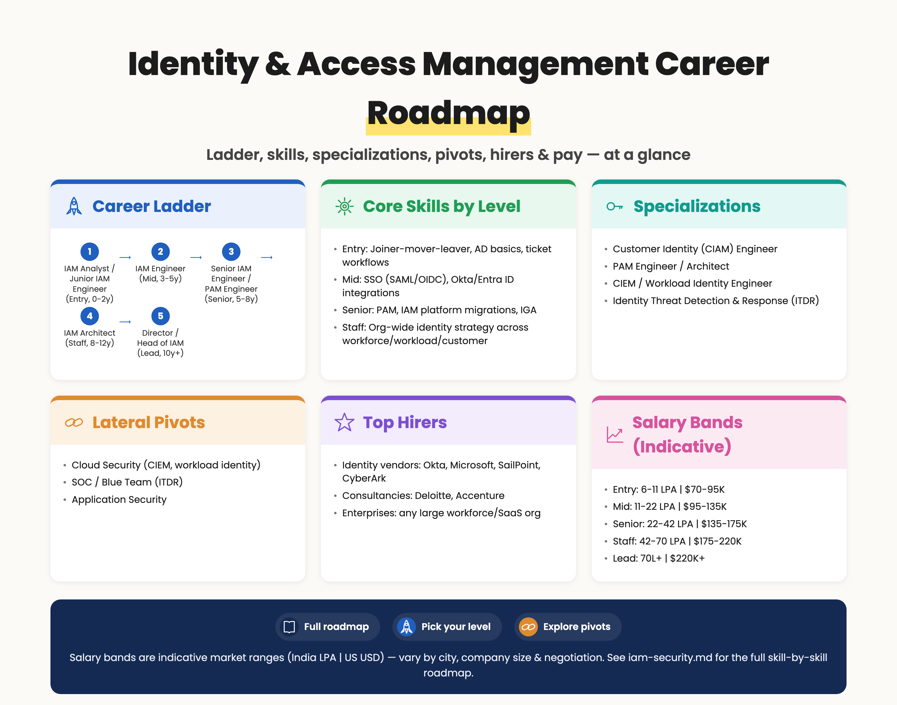

# Identity & Access Management (IAM) Career Roadmap

> 📘 Recommended study plans: [IAM Study Plan](https://github.com/jassics/security-study-plan/blob/main/iam-security-study-plan.md) · [Common Skills](https://github.com/jassics/security-study-plan/blob/main/common-skills-study-plan.md) · [Product Security](https://github.com/jassics/security-study-plan/blob/main/product-security-study-plan.md).

Identity is the **new perimeter**. As workloads moved from datacenters to cloud and SaaS, the firewall stopped being the primary control — *who can do what* became the primary control. IAM is one of the **highest-volume, highest-leverage, and least-glamorous** career tracks in cybersecurity. It pays well, is in demand at every company that has more than ~50 employees, and has a clean ladder all the way to architect / VP of Identity.

> Most breaches start with **identity compromise** — phishing, credential stuffing, OAuth abuse, helpdesk social engineering, MFA fatigue. If you secure identity well, you cut off the most common attack path.


> Salary bands above are indicative market ranges (India LPA | US USD) — vary by city, company size, and negotiation.

<details>
<summary>Branching mindmap (Mermaid — click to expand)</summary>

```mermaid
mindmap
  root((IAM Career))
    Career Ladder
      Entry: IAM Analyst / Junior IAM Engineer
        Mid: IAM Engineer
          Senior: Senior IAM Engineer / PAM Engineer
            Staff: IAM Architect
              Lead: Director / Head of IAM
    Specializations
      Customer Identity (CIAM) Engineer
      PAM Engineer / Architect
      CIEM / Workload Identity Engineer
      Identity Threat Detection and Response
    Lateral Pivots
      Cloud Security
      SOC / Blue Team
      Application Security
```

</details>

## Top hirers (illustrative)
- **Identity vendors**: Okta, Microsoft, SailPoint, CyberArk
- **Consultancies**: Deloitte, Accenture
- **Enterprises**: any large workforce/SaaS org

## Salary bands (indicative — India LPA | US USD, varies by city/company/negotiation)
| Level | India (LPA) | US (USD) |
|-------|-------------|----------|
| Entry | 6–11 | $70K–95K |
| Mid | 11–22 | $95K–135K |
| Senior | 22–42 | $135K–175K |
| Staff | 42–70 | $175K–220K |
| Lead | 70L+ | $220K+ |

## Who is this for?
- IT / Active Directory / Helpdesk admins moving into security
- SOC / Blue Team analysts wanting a deeper, more architectural specialization
- Cloud engineers handling IAM in AWS / Azure / GCP
- AppSec engineers interested in OAuth / OIDC / SAML protocol security
- GRC / Audit folks who want to go more technical

## What "IAM" actually covers (the surface area)
IAM is broader than most people realize. The major sub-domains are:

1. **Workforce IAM** — employees and contractors signing into corporate apps (Okta, Azure AD / Entra ID, Ping)
2. **Customer IAM (CIAM)** — your end users signing in to your product (Auth0, Cognito, Azure AD B2C, Frontegg)
3. **Privileged Access Management (PAM)** — admin / root / break-glass access (CyberArk, BeyondTrust, Delinea)
4. **Identity Governance & Administration (IGA)** — joiner-mover-leaver, access reviews, certifications, SoD (SailPoint, Saviynt, Omada)
5. **Workload / Non-human Identity** — service accounts, machine identities, secrets (HashiCorp Vault, AWS IAM, GCP Workload Identity, SPIFFE/SPIRE, Akeyless)
6. **Cloud IAM (CIEM)** — entitlements across AWS / Azure / GCP (Wiz, Tenable Cloud, Sonrai, AWS IAM Access Analyzer)
7. **Federation & SSO** — SAML, OIDC, WS-Fed, SCIM provisioning
8. **Authentication standards** — passwords, MFA, FIDO2 / WebAuthn / Passkeys
9. **Authorization standards** — RBAC, ABAC, ReBAC (Zanzibar-style), policy engines (OPA, Cedar)

Most IAM jobs sit primarily in 1–3 of these. As you grow senior, you connect them all.

## Pre-requisites (foundation)
1. Active Directory basics — OUs, groups, GPO, Kerberos, NTLM
2. Solid networking — DNS, TLS, HTTP, certificates
3. Linux + Windows admin comfort
4. Scripting — PowerShell + Python at minimum
5. One cloud's IAM model (start with AWS or Azure, learn the others later)
6. Comfortable reading specs — RFCs (OAuth 2.1, OIDC, SAML 2.0, SCIM)

## Career ladder

### Entry — IAM Analyst / Junior IAM Engineer (0–2 yrs)
**Typical work**

- Provisioning / deprovisioning user accounts (joiner-mover-leaver tickets)
- Group membership reviews, access-request approvals
- Password reset, MFA reset, account unlock
- Helpdesk-grade L1 / L2 IAM tooling work in Okta, Azure AD, Active Directory
- Maintaining group naming conventions and documentation

**Skills**

- AD / Entra ID basics (users, groups, OUs, conditional access)
- Okta or Azure AD admin console fluency
- PowerShell + basic Python
- Ticketing (ServiceNow / Jira) and ITIL basics

**Certs**

- Microsoft SC-300 (Identity & Access Administrator) — *the* best entry-level signal
- Okta Certified Professional / Administrator
- AWS Certified Cloud Practitioner

### Mid — IAM Engineer (3–5 yrs)
**Typical work**

- Build SSO integrations (SAML / OIDC) for new SaaS apps
- Write SCIM provisioning flows
- Configure Conditional Access / Okta policies (location, device, risk, MFA step-up)
- Onboard apps into IGA (SailPoint / Saviynt) — owners, certifications, SoD rules
- Implement and tune phishing-resistant MFA (FIDO2, Passkeys, Windows Hello)
- Cloud IAM: AWS IAM roles, GCP IAM bindings, Azure RBAC, least-privilege reviews

**Skills**

- Deep SAML 2.0, OIDC, OAuth 2.1 (you'll debug these in HAR files)
- Strong scripting (Python + Terraform + PowerShell)
- IGA platform (SailPoint IdentityIQ / IdentityNow, Saviynt, Omada)
- One cloud's IAM in depth

**Certs**

- Microsoft SC-300, AZ-500
- Okta Certified Consultant
- SailPoint or Saviynt vendor certs
- AWS Security Specialty

### Senior — Senior IAM Engineer / PAM Engineer (5–8 yrs)
**Typical work**

- Lead implementations of new IAM platforms (e.g., AD migration to Entra ID, Okta workforce roll-out)
- Design and operate PAM (CyberArk / BeyondTrust / Delinea)
- Drive Zero Trust identity controls — phishing-resistant MFA org-wide, device trust
- Build self-service access portals on top of IGA
- Lead CIEM rollouts to right-size cloud entitlements
- Run IAM tabletop exercises and IR for identity incidents (token theft, OAuth abuse, helpdesk social engineering)

**Skills**

- Strong PAM platform (CyberArk PAS, BeyondTrust PRA, Delinea Secret Server)
- Cloud IAM across at least 2 clouds
- Detection content for identity attacks (Okta ITP, Azure AD Identity Protection, Microsoft Defender for Identity, Falcon ITDR)
- Understanding of nation-state identity TTPs (Solorigate, Storm-0558, Scattered Spider, Lapsus$)

**Certs**

- CyberArk Defender / Sentry
- CISSP (broad cred)
- AWS / Azure / GCP advanced security certs

### Staff / Architect — IAM Architect (8+ yrs)
**Typical work**

- Define org-wide identity strategy across workforce, workload, and customer identity
- Drive Zero Trust roadmap with identity at the core
- Design CIAM platforms balancing UX, fraud, and compliance (passkeys, risk-based auth, social login, age-gating)
- Pick and standardize tooling across BUs after acquisitions
- Influence product teams on AuthN/AuthZ design (RBAC vs ABAC vs ReBAC)
- Engage with vendors as a power customer; influence roadmaps

**Skills**

- Identity protocol mastery (SAML, OIDC, OAuth 2.1, FIDO2 / WebAuthn, SCIM, FAPI for fintech)
- Authorization patterns (OPA, Cedar, Zanzibar / OpenFGA / SpiceDB)
- Strong threat modeling on identity systems
- Communication — you'll write architecture docs and exec briefings

**Certs**

- CISSP-ISSAP (Architecture)
- IDPro CIDPRO (newer, identity-specific)

### Director / VP Identity / Head of IAM (10+ yrs)
**Typical work**

- Build and lead the IAM org (workforce, CIAM, IGA, PAM teams)
- Own the identity budget (often the biggest line item in security)
- Report to the CISO; partner with HR, IT, Finance, Product
- Drive M&A integrations — IAM is always on the critical path

## Specialization branches

### Customer Identity (CIAM) Engineer / Architect
- Sits between AppSec, Product, and Marketing
- Auth0 / Okta CIC, AWS Cognito, Azure AD B2C, Frontegg, FusionAuth
- Heavy on fraud signals, risk-based auth, passkeys at scale
- Strong demand in fintech, gaming, e-commerce, streaming

### PAM Engineer / Architect
- Vendor-deep (CyberArk, BeyondTrust, Delinea, HashiCorp Boundary)
- Standing access → just-in-time access
- Heavy in BFSI, healthcare, government

### IGA Architect
- SailPoint / Saviynt / Omada deep
- Joiner-mover-leaver automation, access certifications, SoD
- Strong overlap with audit / SOX / SOC 2

### Workload Identity / Secrets Engineer
- HashiCorp Vault, SPIFFE / SPIRE, AWS IAM Roles Anywhere, GCP Workload Identity Federation
- mTLS everywhere, short-lived credentials, secret-zero problem
- Strong overlap with DevSecOps and platform engineering

### Cloud Infrastructure Entitlement (CIEM)
- Wiz / Orca / Tenable Cloud / Sonrai / Ermetic
- Right-sizing IAM permissions across thousands of accounts
- Strong overlap with Cloud Security

### Identity Threat Detection & Response (ITDR)
- New category — Microsoft Defender for Identity, Okta ITP, Falcon ITDR, Silverfort
- Detection of token theft, OAuth abuse, AD attacks (Kerberoasting, DCSync, Golden Ticket)
- Strong overlap with SOC / Blue Team

### Identity Standards / Open-Source contributor
- Contribute to OpenID Foundation working groups (FAPI, Shared Signals)
- Contribute to projects like Keycloak, OpenFGA, Cedar, SPIFFE/SPIRE

## Career paths from IAM

```text
                 IT / AD / Helpdesk Admin
                          │
                          ▼
                  IAM Analyst (entry)
                          │
                          ▼
                    IAM Engineer
       ┌──────────────┬──┴──┬──────────────┬─────────────┐
       ▼              ▼     ▼              ▼             ▼
  Senior IAM       PAM    IGA          CIAM         Workload /
   Engineer       Eng    Eng          Engineer       Secrets Eng
       │           │      │              │              │
       └─────┬─────┴───┬──┴──────┬───────┘              │
             ▼         ▼         ▼                      ▼
       IAM Architect / Identity Architect         CIEM / Cloud
             │                                     IAM Architect
             ▼
       Head of IAM / Director of Identity
             │
             ▼
       Deputy CISO  →  CISO / vCISO
```

## Lateral pivots from / into IAM
- **AppSec → IAM** — natural for engineers who like protocols (OAuth / OIDC / SAML)
- **Cloud Security → IAM** — CIEM, workload identity, RBAC at scale
- **SOC / Blue Team → ITDR** — identity-focused detection
- **GRC / Audit → IGA / SoD** — clean fit
- **IAM → Security Architect** — common senior path
- **IAM → Product Security** — owning AuthN/AuthZ inside the product

## AI-augmented IAM (you need this in 2025+)

### Using AI to do IAM better
1. **Access review summarization** — turn raw IGA exports into manager-friendly recerts
2. **Policy drafting** — first-draft Conditional Access / Okta sign-on / OPA / Cedar policies from natural language
3. **CIEM remediation suggestions** — explain *why* a permission is risky and propose minimum-privilege swap
4. **Identity incident triage** — summarize sign-in logs, anomalous OAuth grants, token replay events
5. **SCIM / API onboarding** — generate first-pass connectors for new SaaS apps
6. **Detection content** — Sigma / KQL rules for Entra ID + Okta + AD attacks

### Securing AI agents (the new identity problem)
This is rapidly becoming a **dedicated IAM sub-track**:

1. **Non-human identities for AI agents** — Copilot, Cursor, custom agents need scoped credentials
2. **OAuth / token scopes for AI** — least privilege when agents act on user behalf
3. **MCP (Model Context Protocol) auth** — emerging standard for agent ↔ tool authorization
4. **Delegated authority + audit** — proving "user A asked agent X to do Y on system Z"
5. **Just-in-time secrets for AI** — short-lived credentials issued per-task, not per-agent
6. **Detecting agent abuse** — anomalous API call patterns from an agent's identity
7. **Phishing-resistant MFA against AI-powered phishing / vishing** (deepfake helpdesk calls are real)

### Authorization for AI features
- ABAC / ReBAC (OpenFGA, SpiceDB, Cedar) for "user X can ask the LLM about document Y"
- RAG security: identity-aware retrieval so the LLM only sees data the *user* can see
- Tenant isolation in multi-tenant LLM features

See: [AI Security Career Roadmap](ai-security-career-roadmap.md) · [GenAI Security Study Plan](https://github.com/jassics/security-study-plan/blob/main/genai-security-study-plan.md)

## Recommended tools to master
- **Workforce IDP**: Okta, Microsoft Entra ID (Azure AD), Ping Identity, JumpCloud
- **CIAM**: Auth0 / Okta CIC, AWS Cognito, Azure AD B2C, Frontegg, FusionAuth, Stytch, Clerk
- **IGA**: SailPoint IdentityIQ / IdentityNow, Saviynt, Omada, Microsoft Entra ID Governance
- **PAM**: CyberArk, BeyondTrust, Delinea (Thycotic), HashiCorp Boundary, Teleport, StrongDM
- **Secrets**: HashiCorp Vault, AWS Secrets Manager, GCP Secret Manager, Akeyless, Doppler, 1Password Secrets Automation
- **Workload identity**: SPIFFE / SPIRE, AWS IAM Roles Anywhere, GCP Workload Identity Federation, Azure Workload Identity
- **Authorization**: OPA / Rego, Cedar, OpenFGA, SpiceDB, AuthZed
- **CIEM**: Wiz, Orca, Tenable Cloud, Sonrai, Ermetic (Tenable), Microsoft Entra Permissions Management
- **ITDR**: Microsoft Defender for Identity, Falcon ITDR, Okta ITP, Silverfort, Semperis
- **AD assessment / attack tools** (you should know these even on the defense side): BloodHound, PingCastle, ADRecon, Rubeus, Mimikatz, Impacket
- **Open-source IDP**: Keycloak, Authentik, Authelia, Ory (Hydra / Kratos / Keto)

## Recommended labs / resources
- HackTricks — Active Directory & Cloud IAM sections
- Microsoft Learn — SC-300 path
- Okta Learning Portal — workforce + CIC tracks
- AWS Skill Builder — IAM and Security Specialty
- TryHackMe — Active Directory + Azure paths
- HackTheBox — AD pro labs
- BloodHound Community Edition + Game of Active Directory (GOAD) lab
- OWASP ASVS chapter on Authentication & Authorization
- IDPro Body of Knowledge (free, excellent reference)

## Recommended books
- *Solving Identity Management in Modern Applications* — Yvonne Wilson, Abhishek Hingnikar (OAuth/OIDC focused)
- *OAuth 2 in Action* — Justin Richer, Antonio Sanso
- *Identity-Native Infrastructure Access Management* — Ev Kontsevoy et al. (Teleport)
- *Active Directory* — Brian Desmond et al. (O'Reilly)
- *Mastering Identity and Access Management with Microsoft Azure* — Jochen Nickel
- *The Tangled Web* — Michal Zalewski (CIAM-relevant attacks)

## Recommended communities & content
- **IDPro** — the professional body; their podcasts and webinars are gold
- **OpenID Foundation** working groups
- **Cloud Security Alliance** IAM working group
- **r/sysadmin**, **r/AzureAD**, **r/identitymanagement**
- Conferences: **Identiverse**, **Authenticate** (FIDO Alliance), **Gartner IAM Summit**, **Microsoft Ignite**, **Oktane**

## Common pitfalls (what employers want you NOT to do)
1. Treat IAM as helpdesk forever — push toward engineering/architecture
2. Ignore non-human identities (they outnumber humans 10–50x in cloud)
3. Conflate authentication with authorization
4. Build custom auth instead of adopting standards
5. Give long-lived static credentials when short-lived would work
6. Forget joiner-mover-**leaver** (de-provisioning is where most audit findings live)
7. Treat MFA as binary — phishing-resistant MFA is a meaningfully different control
8. Skip session security (cookie / token theft is the #1 bypass for MFA)
9. Build IAM in isolation from product / engineering — IAM is a product

## Next step
If you're starting fresh, target **SC-300 + Okta Certified Professional** in your first year and do TryHackMe AD path on the side. Pick one of: PAM, IGA, CIAM, or Workload Identity for your first specialization in years 2–4.

Companion JDs: see **[Security Architect JDs](JDs/security-architect.md)** (Identity Architect roles) and **[Cloud Security JDs](JDs/cloud-security.md)** (CIEM and workload identity roles).
