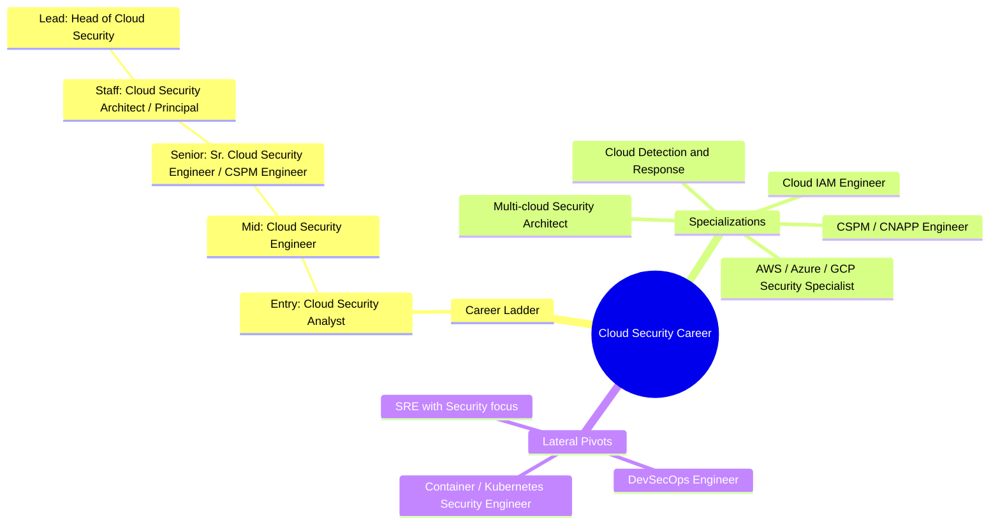

# Cloud Security Career — Branching Mindmap

Renders natively on GitHub. Source of truth for `cloud-security.md` / `security-job-roles.md` §4.

## Outline (notes / ticket friendly)

- **Cloud Security Career**
  - **Career Ladder**
    - Entry (0–2y): Cloud Security Analyst
    - Mid (2–5y): Cloud Security Engineer
    - Senior (5–8y): Senior Cloud Security Engineer / CSPM Engineer
    - Staff (8–12y): Cloud Security Architect / Principal Cloud Security Engineer
    - Lead (10y+): Head of Cloud Security
  - **Specializations** (branch off at Mid/Senior)
    - AWS / Azure / GCP Security Specialist
    - CSPM / CNAPP Engineer
    - Cloud IAM Engineer
    - Cloud Detection & Response
    - Multi-cloud Security Architect
  - **Lateral Pivots** (branch off at Mid/Senior)
    - → DevSecOps Engineer
    - → Container / Kubernetes Security Engineer
    - → SRE with Security focus
