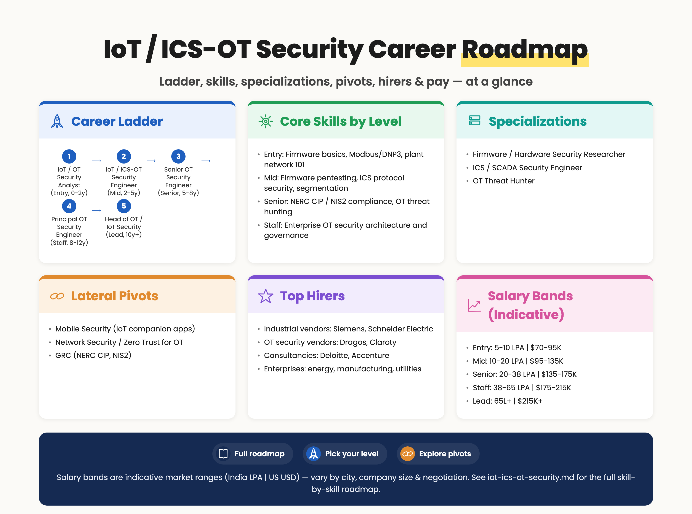
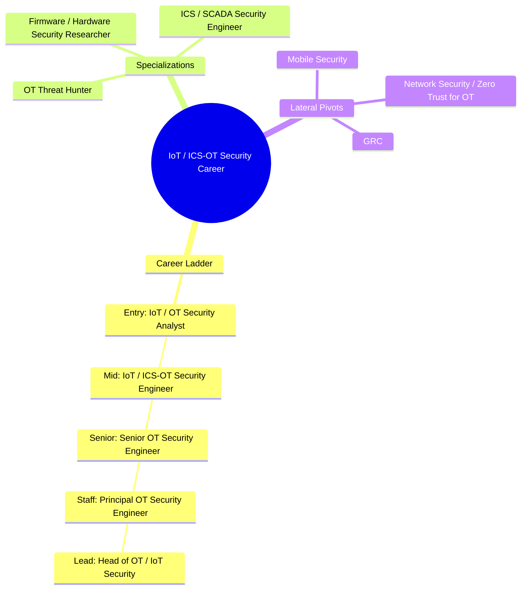

# IoT / ICS-OT Security Career Roadmap

> 📘 Recommended study plans: [Reverse Engineering & Malware Analysis](https://github.com/jassics/security-study-plan/blob/main/reverse-engineering-malware-security-study-plan.md) · [Common Skills](https://github.com/jassics/security-study-plan/blob/main/common-skills-study-plan.md).

This page covers two **related but distinct** specializations that are often grouped together:

- **IoT (Internet of Things) Security** — consumer + commercial connected devices (smart bulbs, locks, cameras, medical wearables, automotive infotainment, etc.).
- **ICS / OT (Industrial Control Systems / Operational Technology) Security** — the systems that run factories, power grids, oil & gas pipelines, water treatment, manufacturing, and transportation.

Both are "hardware-meets-software-meets-network" tracks. Demand is *not* huge in raw headcount (compared to AppSec or SOC), but it's **specialized, well-paid, and one of the harder fields to break into** — which is exactly why it stays valuable.


> Salary bands above are indicative market ranges (India LPA | US USD) — vary by city, company size, and negotiation.

<details>
<summary>Branching mindmap (Mermaid — click to expand)</summary>



</details>

## Top hirers (illustrative)
- **Industrial vendors**: Siemens, Schneider Electric
- **OT security vendors**: Dragos, Claroty
- **Consultancies**: Deloitte, Accenture
- **Enterprises**: energy, manufacturing, utilities

## Salary bands (indicative — India LPA | US USD, varies by city/company/negotiation)
| Level | India (LPA) | US (USD) |
|-------|-------------|----------|
| Entry | 5–10 | $70K–95K |
| Mid | 10–20 | $95K–135K |
| Senior | 20–38 | $135K–175K |
| Staff | 38–65 | $175K–215K |
| Lead | 65L+ | $215K+ |

## IoT vs. ICS / OT — what's the difference?
| Aspect | IoT | ICS / OT |
|--------|-----|----------|
| Typical devices | Smart bulb, camera, watch, car infotainment, medical wearable | PLCs, RTUs, HMIs, DCS, SCADA |
| Network protocols | MQTT, CoAP, BLE, Zigbee, Z-Wave, Wi-Fi, LoRa, NB-IoT | Modbus, DNP3, IEC 60870-5-104, IEC 61850, EtherNet/IP, PROFINET, BACnet, OPC-UA |
| Lifecycle | 1–5 years, frequent firmware updates | 15–30 years, rarely patched |
| Top concern | Privacy + remote takeover | Safety + reliability (uptime, no kinetic damage) |
| Standards | ETSI EN 303 645, NISTIR 8259, OWASP IoT Top 10 | IEC 62443, NIST 800-82, NERC CIP, IEC 61511 |
| Industries | Consumer, healthcare wearables, automotive infotainment | Power, oil & gas, manufacturing, water, transport, pharma |

Most senior practitioners eventually learn both, but career-wise, **pick one to start**.

## Who is this for?
- Embedded / firmware developers moving to security
- Electrical / electronics / mechatronics engineers wanting a cyber career
- Network security engineers fascinated by industrial protocols
- Reverse engineers wanting to specialize in firmware
- Plant / control engineers (OT side) adding security responsibilities

## Pre-requisites (foundation)

### Common
1. Strong networking — TCP/IP, packet capture, Wireshark
2. Linux + at least one scripting language (Python, ideally + a little C)
3. OWASP Top 10 awareness
4. Basic cryptography (AES, RSA, hashing, signing)

### IoT-specific
1. Embedded systems basics — microcontrollers (ARM Cortex-M, ESP32), MCU vs MPU
2. Soldering, basic electronics, multimeter usage, logic analyzers
3. UART / JTAG / SWD interfaces
4. Wireless basics — BLE, Wi-Fi, Zigbee, RF concepts

### ICS/OT-specific
1. Industrial automation basics — what's a PLC, HMI, SCADA, DCS, Historian
2. **IEC 62443** standard awareness (the umbrella for industrial cyber)
3. Purdue Reference Model (Levels 0–5)
4. Safety vs Security mindset — "shutdown is not always the safe option"
5. Familiarity with at least one industrial protocol (Modbus TCP is the cheapest to learn)

## Career ladder — IoT Security

### Entry level (0–2 years)
**Possible job titles:**

- IoT Security Analyst
- Embedded Security Engineer (Junior)
- Firmware Security Tester (Junior)

**Skills to focus on:**

1. **OWASP IoT Top 10** — weak passwords, insecure network services, insecure ecosystem interfaces, lack of secure update, use of insecure/outdated components, insufficient privacy protection, insecure data transfer/storage, lack of device management, insecure default settings, lack of physical hardening
2. **Firmware extraction** — from updates (downloaded `.bin`), from flash chips (SPI flash dumps via `flashrom`, CH341A programmer), via UART boot interrupt, via JTAG (`OpenOCD`)
3. **Firmware analysis** — `binwalk`, `firmware-mod-kit`, `FACT`, `EMBA`, mounting squashfs/JFFS2
4. **Common IoT vulns** — hardcoded credentials, telnet/SSH backdoors, command injection in web UI, unsigned firmware updates, plaintext OTA
5. **Network analysis** — sniffing MQTT/CoAP, intercepting cloud APIs (typical mobile app + cloud + device triangle)
6. **Web UI testing** on IoT admin interfaces (Burp Suite)
7. **Mobile companion apps** — overlap with [mobile-security.md](mobile-security.md)
8. **BLE / Zigbee basics** — `bluetoothctl`, `gatttool`, `bettercap`, sniffing with Ubertooth / Sonoff / Ti CC2531

**Practice platforms:**

- Damn Vulnerable IoT Device (DVID)
- IoTGoat (OWASP)
- Attify Badge / IoT Exploitation Learning Kit (paid hardware)
- Old / cheap routers (used Wi-Fi routers, IP cameras from local market) — best real-world targets

**Entry certs:**

- Practical IoT Pentest course (Attify / 8kSec / Cybrary)
- Offensive IoT Exploitation (OIE) — Attify
- CompTIA Security+ for baseline

### Mid level (2–5 years)
**Possible job titles:**

- IoT Security Engineer
- Embedded Security Engineer
- Hardware Security Researcher (Junior)

**New skills to add:**

1. **Reverse engineering firmware** — `Ghidra`, `IDA Pro`, `radare2` for MIPS / ARM
2. **Bootloader analysis** — U-Boot environment manipulation, secure boot bypasses
3. **Side-channel attacks (intro)** — power analysis, timing attacks (with ChipWhisperer)
4. **Fault injection (glitching)** — voltage glitching, EM glitching (advanced; ChipWhisperer / GlitchKit)
5. **RF / SDR** — HackRF One, RTL-SDR, GnuRadio for sub-GHz, replay attacks on garage doors, key fobs
6. **Zigbee / Z-Wave deep dive** — KillerBee, Zigator
7. **BLE attacks** — `bleah`, `gattacker`, MITM via BTLEJack
8. **Hardware backdoor design / detection**
9. **Threat modeling IoT systems end-to-end** — device + gateway + cloud + mobile

**Certs to consider:**

- Offensive IoT Exploitation (Attify)
- SANS SEC556 / GICSP-adjacent
- 8kSec / Mobile Hacking Lab IoT track
- CRTL (vendor-neutral hardware hacking, where available)

### Senior level (5–8 years) — IoT
**Possible job titles:**

- Senior IoT Security Engineer
- IoT Security Architect
- IoT Vulnerability Researcher
- Automotive Security Engineer (for car / fleet world)

**Focus areas:**

1. **Secure SDLC for hardware** — secure boot, secure provisioning, attestation, OTA design
2. **Hardware root of trust** — TPM, ARM TrustZone, Apple Secure Enclave, Microchip ATECC
3. **Lifecycle security** — manufacturing, deployment, EOL
4. **Automotive specifics** — CAN bus (`can-utils`, `caringcaribou`), UDS, AUTOSAR, V2X (if in auto)
5. **Medical device specifics** — FDA pre-market cyber requirements, ISO 14971
6. **Regulatory** — EU CRA (Cyber Resilience Act), ETSI EN 303 645, UK PSTI

## Career ladder — ICS / OT Security

### Entry level (0–2 years)
**Possible job titles:**

- OT Security Analyst
- ICS Security Engineer (Junior)
- SCADA Security Analyst
- Industrial Cybersecurity Consultant (Junior)

**Skills to focus on:**

1. **Purdue Model** — what lives at Level 0 (sensors/actuators), 1 (PLC/RTU), 2 (HMI/SCADA), 3 (operations), 3.5 (DMZ), 4 (IT business), 5 (enterprise/cloud)
2. **Industrial protocols** — Modbus TCP (start here; simplest), DNP3, EtherNet/IP, PROFINET, IEC 60870-5-104, IEC 61850 (energy), OPC-UA (modern)
3. **PLC basics** — ladder logic, function block diagram, structured text; vendors: Siemens (S7), Allen-Bradley (Rockwell), Schneider Modicon, Mitsubishi
4. **IEC 62443** standard — Zones & Conduits, SL-1 to SL-4
5. **Passive monitoring tools** — Claroty, Nozomi Networks Guardian, Dragos Platform, Tenable.OT, Forescout (eyeInspect / SilentDefense)
6. **Asset inventory in OT** — why active scanning is dangerous; passive discovery
7. **Reading IT/OT network architectures** — air gaps, DMZs, jump hosts, data diodes
8. **Common OT incidents** — Stuxnet, Ukraine 2015/2016, Triton/TRISIS, Colonial Pipeline (IT-side but illustrative), Industroyer/Industroyer2, Pipedream/Incontroller (case studies)

**Entry certs:**

- **GICSP** (Global Industrial Cyber Security Professional) — the gateway cert
- ISA/IEC 62443 Cybersecurity Fundamentals Specialist
- CompTIA Security+ as baseline
- Dragos / Claroty / Nozomi vendor training (free for many)

### Mid level (2–5 years)
**Possible job titles:**

- ICS / OT Security Engineer
- OT SOC Analyst
- Industrial Penetration Tester
- OT Incident Responder

**New skills to add:**

1. **Active testing in lab environments** — building a small Siemens / Rockwell rig, using `pymodbus`, `plcscan`, `Conpot` honeypots
2. **OT pentest methodology** — *never* on production; lab + air-gapped replicas; safety-first scoping
3. **Network segmentation design** — IT/OT DMZ, jump servers, data diodes (Owl, Waterfall)
4. **OT incident response** — different playbook from IT (you can't "isolate and reboot" a turbine)
5. **MITRE ATT&CK for ICS** — ICS-specific tactics & techniques
6. **OT-specific SIEM** — Splunk for ICS, Dragos integrations
7. **NERC CIP compliance** (North America energy) or similar regional regs
8. **Industrial Wireless** — WirelessHART, ISA100, industrial Wi-Fi
9. **Building / Smart Building Systems** — BACnet, Modbus over RS-485, KNX — increasingly in scope

**Certs to consider:**

- SANS GRID (GIAC Response and Industrial Defense)
- SANS GCIP (GIAC Critical Infrastructure Protection)
- IEC 62443 Risk Assessment / Design Specialist
- Dragos / Nozomi advanced certifications

### Senior level (5–8 years)
**Possible job titles:**

- Senior OT Security Engineer
- ICS / OT Security Architect
- OT Incident Response Lead
- ICS / OT Threat Hunter

**Focus areas:**

1. **OT security program design** for a plant or multi-site organization
2. **Risk assessment using IEC 62443-3-2** — Zones, Conduits, SL-T (target security level)
3. **Secure remote access** for OEMs / contractors (jump hosts, MFA, recording)
4. **Patch management strategy** for systems that may have one maintenance window per year
5. **Threat hunting on industrial telemetry** (Dragos WorldView, MITRE ATT&CK for ICS hunts)
6. **Incident command** in OT environments (with plant manager + safety officer in the room)
7. **Regulatory engagement** — NERC CIP audits, NIS2 (EU), CER Directive
8. **Mentoring** and growing the OT security practice

### Staff / Principal / Architect (8+ years)
**Possible job titles:**

- Principal OT Security Engineer
- OT Security Architect
- Head of OT Cybersecurity
- Director ICS Security
- Global OT Security Lead

**Focus areas:**

- Cross-site / global OT security strategy
- Vendor consolidation across OT detection / firewall / asset inventory
- Joint IT-OT governance
- Working with engineering / safety teams as equals
- Industry leadership — S4 Conference, Dragos / Claroty conferences, ICS Village (DEF CON)

## Career paths

```text
                  Embedded / EE / Plant
                       background
                              │
       ┌──────────────────────┴──────────────────────┐
       ▼                                             ▼
 IoT Security                              ICS / OT Security
       │                                             │
       ▼                                             ▼
 Firmware RE /                              OT SOC Analyst /
 Hardware Hacker                            ICS Pentester
       │                                             │
       ▼                                             ▼
 Automotive Security /                       OT Incident Response /
 Medical Device Security                     OT Threat Hunter
       │                                             │
       ▼                                             ▼
 IoT Security Architect ───────►   ICS / OT Security Architect
                          │
                          ▼
            Director / Head of Embedded & OT Security
```

## Lateral pivots
- **IoT → Mobile Security** (companion apps), **AppSec** (cloud backends), **Hardware VR / 0-day research**
- **OT → Network Security** (segmentation, Zero Trust for OT), **GRC** (NERC CIP, NIS2 compliance), **SOC** (joint IT/OT SOC)

## Recommended tools

### IoT / Firmware / Hardware
- **Static / firmware analysis**: binwalk, FACT, EMBA, firmware-mod-kit, Ghidra, radare2
- **Hardware**: Bus Pirate, ChipWhisperer, Saleae logic analyzer, JTAGulator, Attify Badge, CH341A
- **RF / SDR**: HackRF One, RTL-SDR, YARD Stick One, Flipper Zero (entry / fun)
- **Wireless**: Ubertooth One, Sonoff Zigbee dongle, TI CC2531, nRF52840 dongle
- **Automotive**: CAN-USB adapters (Kvaser, PEAK), can-utils, caringcaribou, ICSim, CANalyzer (paid)

### ICS / OT
- **Passive monitoring**: Claroty xDome, Nozomi Networks Guardian, Dragos Platform, Tenable.OT, Forescout, Microsoft Defender for IoT
- **Protocol analysis**: Wireshark (with industrial dissectors), `pymodbus`, `dnp3` Python libs
- **Honeypots / labs**: Conpot, GRFICSv3, Virtuaplant, ICSsim, Factory.io (simulation)
- **PLC programming environments**: TIA Portal (Siemens), Studio 5000 (Rockwell), Codesys

## Recommended labs / resources
- [OWASP IoT Top 10](https://owasp.org/www-project-internet-of-things/)
- [OWASP Firmware Security Testing Methodology (FSTM)](https://scriptingxss.gitbook.io/firmware-security-testing-methodology/)
- [SANS ICS resources & free posters](https://www.sans.org/industrial-control-systems-security/)
- Dragos free training & blog
- [ICS Village (DEF CON)](https://www.icsvillage.com/)
- ENISA ICS / IoT publications
- S4 Conference YouTube archive

## Recommended books

### IoT / Hardware
- *The Hardware Hacker* — Andrew "bunnie" Huang
- *The IoT Hacker's Handbook* — Aditya Gupta
- *Practical IoT Hacking* — Fotios Chantzis et al. (No Starch)
- *The Car Hacker's Handbook* — Craig Smith

### ICS / OT
- *Industrial Network Security* — Eric D. Knapp & Joel Thomas Langill
- *Hacking Exposed Industrial Control Systems* — Bodungen, Singer, et al.
- *Pentesting Industrial Control Systems* — Paul Smith
- *Countdown to Zero Day* — Kim Zetter (Stuxnet story; essential context)

## Next step
Pick **one entry path**:

- **IoT (consumer / general)** → Buy a $20 used IP camera or Wi-Fi router from a local market; extract its firmware with `binwalk`; find one CVE-class bug; write it up.
- **Automotive** → Set up ICSim (open-source car hacking simulator) + can-utils; replay CAN frames.
- **ICS / OT** → Take ISA/IEC 62443 Fundamentals + spin up GRFICSv3 (free industrial simulation) and learn Modbus by capturing it in Wireshark.
- **Medical / regulated** → Read ENISA's IoT in healthcare report + FDA pre-market cyber guidance.

This domain rewards **hands-on tinkerers** more than any other in security. Buy cheap hardware. Break it. Document it. Repeat.
