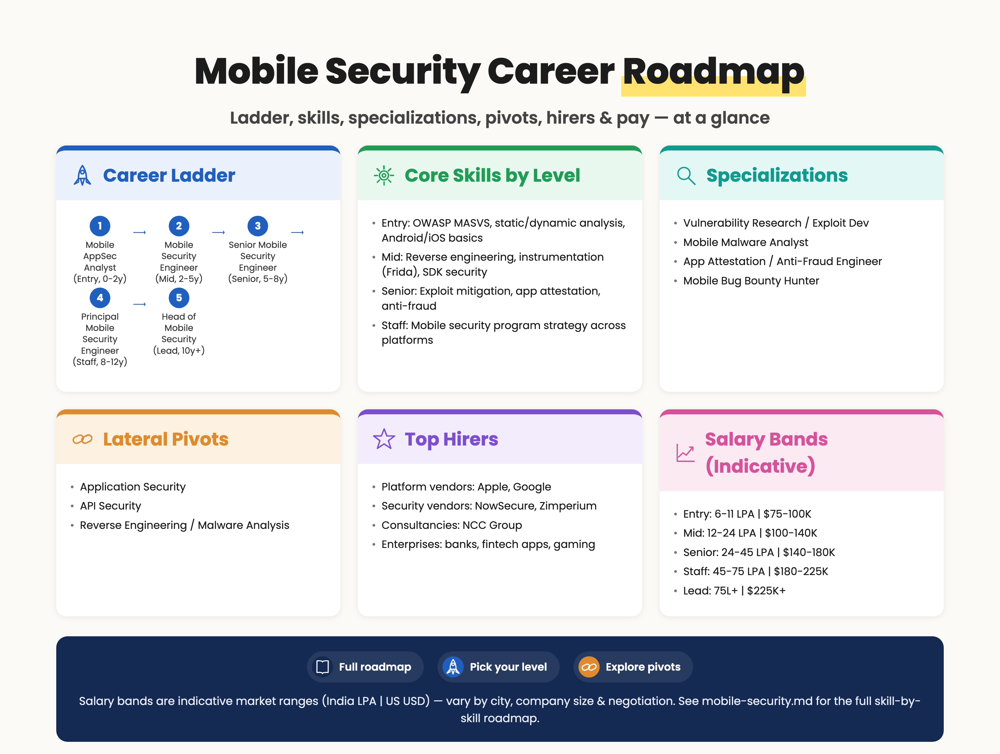
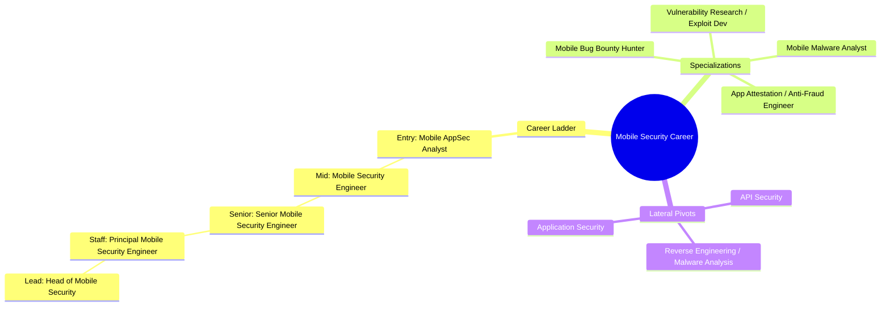

# Mobile Security Career Roadmap

> 📘 Recommended study plans: [Mobile Application Security](https://github.com/jassics/security-study-plan/blob/main/mobile-application-security-study-plan.md) · [Reverse Engineering & Malware Analysis](https://github.com/jassics/security-study-plan/blob/main/reverse-engineering-malware-security-study-plan.md) · [Secure Code Review](https://github.com/jassics/security-study-plan/blob/main/secure-code-review-study-plan.md).

Mobile Security covers the security of **Android, iOS, and cross-platform apps**, the SDKs / third-party libraries they bundle, the device platforms themselves, and the backend APIs they consume. With ~7B+ smartphones in active use, this is a **specialization with consistent demand**, especially in fintech, healthcare, gaming, and ride-hailing.

> If you're new to security, start with [Web Security](web-security.md) first. Mobile security is fundamentally **web/API security + platform-specific reverse engineering**. Most mobile vulnerabilities are eventually API issues.


> Salary bands above are indicative market ranges (India LPA | US USD) — vary by city, company size, and negotiation.

<details>
<summary>Branching mindmap (Mermaid — click to expand)</summary>



</details>

## Top hirers (illustrative)
- **Platform vendors**: Apple, Google
- **Security vendors**: NowSecure, Zimperium
- **Consultancies**: NCC Group
- **Enterprises**: banks, fintech apps, gaming

## Salary bands (indicative — India LPA | US USD, varies by city/company/negotiation)
| Level | India (LPA) | US (USD) |
|-------|-------------|----------|
| Entry | 6–11 | $75K–100K |
| Mid | 12–24 | $100K–140K |
| Senior | 24–45 | $140K–180K |
| Staff | 45–75 | $180K–225K |
| Lead | 75L+ | $225K+ |

## Who is this for?
- Web/API pentesters who want a niche specialization
- Android / iOS developers pivoting into security
- Reverse engineers interested in real-world apps (not just CTF binaries)
- Bug bounty hunters going after mobile-only programs

## Pre-requisites (foundation)
1. **Web/API security fundamentals** (OWASP Top 10 + API Top 10)
2. **Mobile development basics** — Java/Kotlin (Android) **or** Objective-C/Swift (iOS); ideally a tiny "hello world" of each
3. **HTTP / TLS** and proxying tools (Burp Suite, mitmproxy)
4. **Linux command line** and a bit of shell
5. **Smali / ARM assembly basics** (helpful for RE; you'll learn deeper as you go)
6. **Cryptography essentials** — symmetric/asymmetric, KDFs, certificate pinning
7. **One scripting language** — Python is dominant in mobile tooling

## Career ladder

### Entry level (0–2 years)
**Possible job titles:**

- Mobile Application Security Analyst
- Junior Mobile Penetration Tester
- Mobile AppSec Engineer (Junior)
- Bug Bounty Hunter (mobile focus)

**Skills to focus on:**

#### Android
1. **APK anatomy** — `AndroidManifest.xml`, classes.dex, resources, native libs (`*.so`)
2. **Static analysis** — `jadx`, `apktool`, `bytecode-viewer`, `MobSF`
3. **Dynamic analysis** — Android emulator (Genymotion, AVD), real device with `adb`
4. **Activity / Service / BroadcastReceiver / ContentProvider** exploitation — exported components, intent redirection, intent spoofing
5. **Insecure storage** — SharedPreferences without encryption, SQLite plaintext, external storage abuse
6. **Insecure logging** — `Log.d` leaking secrets
7. **WebView issues** — `setJavaScriptEnabled`, `addJavascriptInterface`, file:// access
8. **Network traffic interception** — Burp/mitmproxy + installing user CA + bypassing CA pinning basics
9. **Frida basics** — hooking Java methods, bypassing root detection, bypassing SSL pinning

#### iOS
1. **IPA anatomy** — `Info.plist`, `Mach-O` binaries, `Frameworks/`, code signature
2. **Static analysis** — `class-dump`, `Hopper`, `Ghidra`, `MobSF`, `otool`, `nm`
3. **Dynamic analysis** — Jailbroken iOS / `corellium` (paid) / iOS simulator
4. **Keychain misuse**, NSUserDefaults plaintext storage, Documents/Library/tmp leakage
5. **URL scheme hijacking**, Universal Links handling
6. **Insecure local databases** — Realm, Core Data without encryption
7. **TLS pinning bypass** — `objection`, `frida-ios-dump`, `SSL Kill Switch`
8. **Touch ID / Face ID bypass** in poorly-implemented apps

#### Common (both platforms)
1. **OWASP Mobile Top 10 (MASVS-aligned)** — M1 Improper Credential Usage, M2 Inadequate Supply Chain, M3 Insecure Authentication, M4 Insufficient I/O Validation, M5 Insecure Communication, M6 Inadequate Privacy Controls, M7 Insufficient Binary Protection, M8 Security Misconfiguration, M9 Insecure Data Storage, M10 Insufficient Cryptography
2. **OWASP MASVS + MASTG** (Mobile Application Security Testing Guide) — your bible
3. **Mobile API testing** — same as web, but be ready to extract API calls from binaries
4. **Reporting** mobile-specific bugs clearly with reproduction on emulator or real device

**Practice platforms:**

- DIVA Android, InsecureBankv2, OWASP MSTG-Hacking-Playground
- DVIA-v2 (iOS)
- HackTheBox / TryHackMe mobile boxes
- Bug bounty programs with mobile scope (Twitter, Uber, etc.)

**Entry certs:**

- eMAPT (eLearnSecurity Mobile Application Penetration Tester)
- Mobile Hacking Lab certs (newer)
- TCM Security Mobile Application Penetration Testing course

### Mid level (2–5 years)
**Possible job titles:**

- Mobile Security Engineer
- Mobile Penetration Tester
- Senior Mobile AppSec Engineer
- Mobile Security Consultant

**New skills to add:**

1. **Frida advanced** — custom scripts, hooking native functions, `frida-trace`, `objection` deep usage
2. **Native code review** — `Ghidra` / `IDA Pro` / `radare2` on `*.so` and Mach-O binaries
3. **Reverse engineering obfuscated apps** — DexGuard, ProGuard R8, Bitcode, Swift mangling
4. **Anti-tampering bypass** — root/jailbreak detection, emulator detection, debugger detection, RASP / Promon bypasses
5. **App attestation** — Google Play Integrity API, Apple DeviceCheck / App Attest; how they fail
6. **Mobile-specific crypto issues** — hardcoded keys, weak KDFs, IV reuse, JNI-side encryption
7. **Deep linking abuse** — App Links / Universal Links / custom schemes
8. **WebView bridge abuse** — JavaScript interfaces, Cordova/Ionic/Capacitor bridges, React Native bridges
9. **Cross-platform frameworks** — React Native (`index.android.bundle` analysis), Flutter (`libapp.so`, reFlutter), Xamarin, Unity (IL2CPP)
10. **Mobile SDK / third-party library auditing** — analytics SDKs leaking PII, ad SDKs with vulnerabilities
11. **Mobile threat modeling** — using MASVS, building app-specific threat models

**Certs to consider:**

- OSWE (web code review — directly applicable to mobile backends)
- GMOB (GIAC Mobile Device Security Analyst)
- Mobile Hacking Lab Certified Practitioner
- 8kSec Offensive Mobile

### Senior level (5–8 years)
**Possible job titles:**

- Senior Mobile Security Engineer
- Lead Mobile Pentester / Mobile Red Team Lead
- Mobile Security Architect
- Mobile Security Researcher

**New focus areas:**

1. **Vulnerability research** — finding 0-days in iOS / Android / OEM kernels (the deep end)
2. **Building anti-fraud / RASP solutions** — designing the things you used to break
3. **Secure SDK design** — internal SDK that the org's apps consume
4. **Mobile DevSecOps** — Mobile App Security Testing (MAST) in CI, store-submission gates
5. **Threat intel for mobile** — banking trojans, MaaS (Malware-as-a-Service), watching VirusTotal / Koodous
6. **Lead app store takedown** processes for impersonating / cloned apps
7. **Mentor pentesters**, hire, build a mobile security practice
8. **Cross-functional influence** with iOS/Android platform teams

### Staff / Principal / Architect (8+ years)
**Possible job titles:**

- Principal Mobile Security Engineer
- Mobile Security Architect
- Head of Mobile Security
- Mobile Security Researcher (Vuln Research)

**Focus areas:**

- Org-wide mobile security strategy
- Platform-level security architecture (across iOS / Android / web app shell hybrid)
- Mobile fraud & abuse strategy (heavy fintech)
- External speaking — Black Hat, OBTS (Objective by the Sea), Mobile Hacking Conference, Zer0Con
- Vulnerability research published in CVE feeds, vendor security advisories

## Specialization branches

### Vulnerability Research (VR) / Exploit Development
- Finds 0-days in iOS/Android (kernel, browser, baseband). Apple / Google bug bounty heavy.
- Skills: kernel internals, exploit primitives, sandbox escapes, ROP/JOP, type confusion
- This is one of the hardest tracks in all of security — but pays the most ($1M+ bounties)

### Mobile Malware Analysis
- Reverse engineering banking trojans (Anubis, Cerberus, Hydra), stalkerware, MaaS families
- Tools: APKLab, MobSF, Triage, any.run mobile, Koodous
- Joins blue team / threat intel tracks

### Mobile Bug Bounty (independent)
- Self-employed track. Heavy on Frida / objection / patience.
- Top programs: Apple, Google, Samsung, banking apps, ride-hailing, social media

### App Attestation / Anti-Fraud Engineering
- Build the defenses — RASP, attestation gateways, device fingerprinting
- Tight overlap with backend / cloud security

## Career paths from Mobile Security

```text
                     Mobile Security
                            │
       ┌──────────────┬─────┴─────┬──────────────┐
       ▼              ▼           ▼              ▼
   Mobile        Anti-Fraud /  Vulnerability  Mobile Malware
   Pentester     RASP Engineer Researcher     Analyst
       │              │           │              │
       ▼              ▼           ▼              ▼
   Mobile Sec    Mobile Sec    Exploit Dev /  Threat Intel
   Architect     Architect     0-day Hunter   Lead (Mobile)
                                  │
       └────────────┬──────────────────────┐
                    ▼                       ▼
            Head of Mobile Security    Bug Bounty
                                       (independent)
```

## Lateral pivots from Mobile Security
- **→ Application Security** — natural, since mobile is half AppSec
- **→ API Security** — every mobile app hits an API; deepen that side
- **→ Reverse Engineering / Malware Analysis** — moves you toward DFIR / TI
- **→ Hardware / Embedded Security** — phones are devices; one step into IoT
- **→ Vulnerability Research** — the deep end

## Recommended tools to master
- **Android**: `adb`, `apktool`, `jadx-gui`, `MobSF`, `Frida`, `objection`, `Drozer`, Genymotion, `Hopper`/`Ghidra` for native code
- **iOS**: `Frida`, `objection`, `class-dump`, `Hopper`, `Ghidra`, `frida-ios-dump`, `Cydia Impactor` (legacy), `Sideloadly`, `Filza`, `Cycript` (legacy)
- **Network**: Burp Suite (+ Mobile Assistant), `mitmproxy`, `Charles Proxy`
- **Static**: `MobSF`, `QARK`, `Semgrep` mobile rules
- **Dynamic / CI**: AppSweep, NowSecure, Data Theorem, Quokka.io, Ostorlab

## AI-augmented Mobile Security (you need this in 2025+)
AI is changing both mobile RE work and what's inside the apps.

### Using AI to do mobile security better
1. **AI-assisted decompilation review** — paste jadx / Ghidra output, ask for risky patterns (insecure crypto, hardcoded keys, deeplink handlers)
2. **Frida script generation** — prompt for hook stubs for common bypass patterns; you adapt
3. **Smali / ARM analysis** — explain unfamiliar smali / ARM64 with AI; cross-check
4. **Cross-platform bundle review** — React Native `index.android.bundle`, Flutter `libapp.so` snippets through AI for first-pass triage
5. **Report writing** — mobile findings often need verbose reproduction; AI helps with the boilerplate

### Securing AI features inside mobile apps
Mobile apps now embed on-device LLMs (Apple Foundation Models, Gemini Nano, Llama.cpp) and SDK-based AI features.

1. **On-device model protection** — model files in the IPA / APK are extractable; treat weights as IP + abuse surface
2. **AI SDK API keys** — OpenAI / Anthropic keys hardcoded in mobile apps are a recurring critical bug; never ship them client-side
3. **Prompt injection via OCR / camera input** — attacker-controlled images become prompts
4. **RAG over device data** — contacts, messages, screenshots feeding LLMs needs explicit consent + minimization
5. **Deeplink + AI agent intents** — system AI agents (Siri, Google Assistant, Copilot) call your app via intents; treat them like untrusted callers
6. **Privacy regulator scrutiny** — on-device vs cloud AI changes lawful basis and DPIA requirements

See: [AI Security Career Roadmap](ai-security-career-roadmap.md) · [GenAI Security Study Plan](https://github.com/jassics/security-study-plan/blob/main/genai-security-study-plan.md)

## Recommended labs / resources
- [OWASP MASTG](https://mas.owasp.org/MASTG/) — gold standard
- [OWASP MASVS](https://mas.owasp.org/MASVS/) — verification standard
- DIVA, DVIA-v2, InsecureBankv2, AndroGoat, iGoat
- HackTricks Mobile section
- 8kSec, Mobile Hacking Lab labs (paid)
- Apple Security Research / Google Project Zero blogs

## Recommended books
- *The Mobile Application Hacker's Handbook* — Chell, Erasmus, Colley, Whitehouse
- *iOS Hacker's Handbook* — Charlie Miller et al.
- *Android Security Internals* — Nikolay Elenkov
- *The Art of Mac Malware (Vol 1 & 2)* — Patrick Wardle (loosely related, iOS adjacent)
- *iOS Application Security* — David Thiel

## Recommended creators / blogs
- @ivRodriguezCA, @LaurieWired, @bagipro, @FCE365 on Twitter/X
- Frida Cookbook (frida.re)
- 8kSec blog
- ProjectZero (Google) and Apple Security Research

## Next step
1. Pick **one platform first** (Android is easier to start due to free tools and easier rooting).
2. Set up a test phone or emulator + Burp + Frida; install DIVA / InsecureBankv2.
3. Work through the **entire OWASP MASTG** for that platform — one technique per day.
4. Attempt eMAPT or the TCM Mobile course as your first certification.
5. Pick **one** bug bounty program with mobile scope and spend 2 weekends on it.
