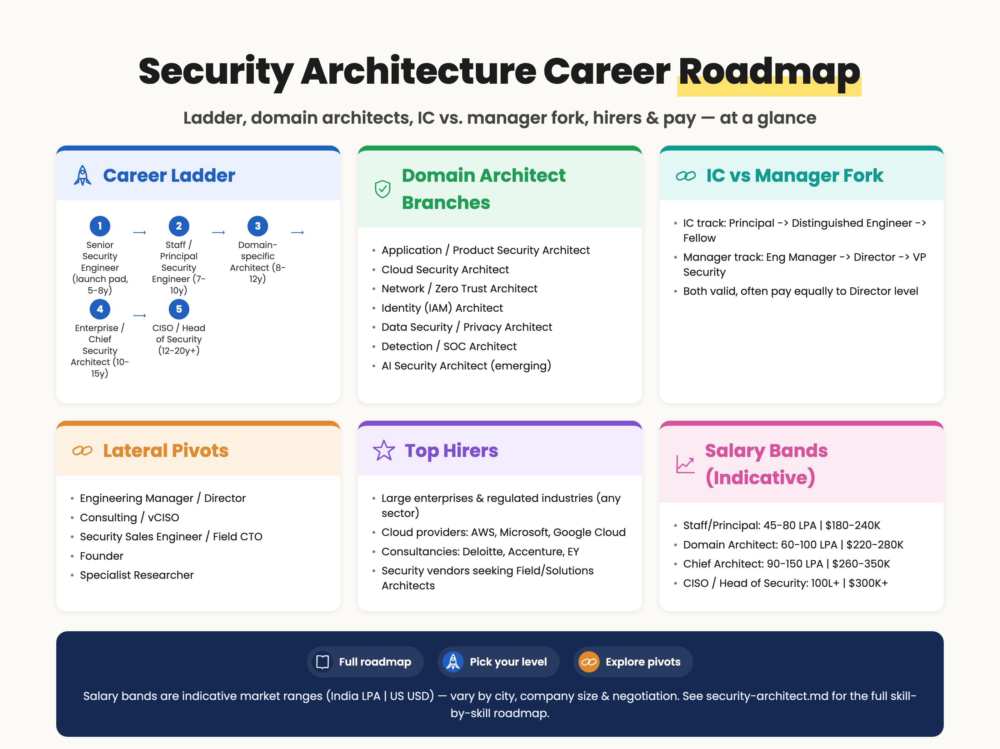
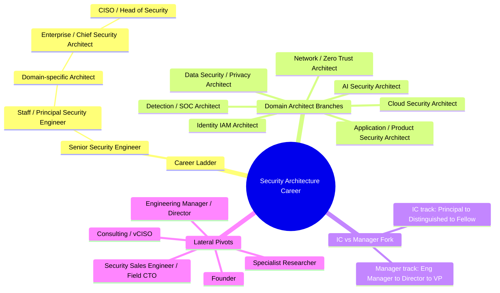

# Security Architecture Career Roadmap

This roadmap is for security engineers who want to grow into **architecture and senior leadership** roles \u2014 Security Architect, Principal Engineer, Distinguished Engineer, and eventually Head of Security / CISO.

Unlike domain pages (web, cloud, devsecops), this is a **horizontal track** \u2014 you become an architect *of* a domain (or multiple) rather than building a new technical specialization from scratch.

> \ud83d\udcd8 Recommended study plan: [Security Architecture Study Plan](https://github.com/jassics/security-study-plan/blob/main/security-architecture-study-plan.md) by Jassics.


> Salary bands above are indicative market ranges (India LPA | US USD) \u2014 vary by city, company size, and negotiation.

<details>
<summary>Branching mindmap (Mermaid \u2014 click to expand)</summary>



</details>

## Top hirers (illustrative)
- **Large enterprises & regulated industries** (any sector)
- **Cloud providers**: AWS, Microsoft, Google Cloud
- **Consultancies**: Deloitte, Accenture, EY
- **Security vendors** seeking Field/Solutions Architects

## Salary bands (indicative \u2014 India LPA | US USD, varies by city/company/negotiation)
| Level | India (LPA) | US (USD) |
|-------|-------------|----------|
| Staff / Principal | 45\u201380 | $180K\u2013240K |
| Domain Architect | 60\u2013100 | $220K\u2013280K |
| Chief Architect | 90\u2013150 | $260K\u2013350K |
| CISO / Head of Security | 100L+ | $300K+ |

## Who is this for?
- Senior security engineers (6+ years) who want to design rather than only implement
- Solutions architects from cloud / enterprise pivoting into security architecture
- Lead pentesters / AppSec engineers who want strategic influence
- CISOs-in-training who need a stronger technical bedrock first

## What does a Security Architect actually do?
At its core, an architect makes **design decisions** that other teams build on top of for years. Day-to-day this means:

- Threat modeling new products, systems, and changes before they ship
- Writing and reviewing **Architecture Decision Records (ADRs)** and RFCs
- Setting and evolving security **reference architectures** (paved roads)
- Vetting vendor and OSS tooling \u2014 build vs buy decisions
- Chairing or sitting on the **Architecture Review Board (ARB)**
- Resolving cross-team security tradeoffs (perf vs security, cost vs security)
- Coaching senior engineers; raising the technical hiring bar
- Translating security risk into business + engineering language
- Representing security in external customer / regulator / auditor conversations

**Architects rarely code full-time.** They prototype, they review code, they write spec; but production ownership is usually on the engineering team that owns the system.

## Pre-requisites (foundation)
1. **6\u20138+ years** of hands-on security engineering experience
2. **Deep depth in at least one domain** (AppSec, Cloud, Network, Identity, SOC, Cryptography, etc.)
3. **Working knowledge of 2\u20133 adjacent domains**
4. Strong **threat modeling** skills (STRIDE, attack trees, PASTA, LINDDUN for privacy)
5. Strong **technical writing** \u2014 you write 10x more than you used to
6. Cloud + on-prem + hybrid mental model
7. Comfort with **business + compliance vocabulary** (risk, SLO/SLA, RTO/RPO, TCO, ARR impact)
8. Stakeholder management \u2014 you'll deal with engineering, product, legal, GRC, sales, sometimes the board

## Career ladder

### Senior Security Engineer (5\u20138 years) \u2014 the launch pad
Before you can architect, prove you can build. Most architects come from:

- Senior Application Security Engineer
- Senior Cloud Security Engineer
- Senior Network / Infrastructure Security Engineer
- Senior IAM Engineer
- Lead Pentester / SOC L3 / Detection Engineering Lead

Signals you're ready to move up: you're already doing **informal architecture work** \u2014 reviewing other teams' designs, writing security RFCs, getting pulled into product reviews.

### Staff / Principal Security Engineer (7\u201310 years)
The **IC track architect**. Heavy hands-on, but the scope expands from a team to a business unit or product area.

**Possible job titles:**

- Staff Security Engineer
- Principal Security Engineer
- Lead Security Engineer (in some orgs)
- Application / Cloud / Product Security Architect

**Skills to focus on:**

1. **Reference architectures** \u2014 design and publish secure-by-default patterns for your domain
2. **Threat modeling at scale** \u2014 lightweight templates teams can self-serve
3. **Cross-team influence** \u2014 use technical writing + ADRs + design reviews to lead without authority
4. **Risk-based decision making** \u2014 know when "perfect" is the enemy of "good enough"
5. **Vendor / tooling strategy** \u2014 lead POCs, total cost of ownership analyses
6. **Mentorship** \u2014 grow senior engineers into staff engineers

### Domain-specific Architects (8\u201312 years)
At this level you specialize *as an architect*. Most common variants:

#### Application / Product Security Architect
- Owns secure SDLC, threat modeling program, AppSec tooling architecture
- Designs secure-by-default platforms, internal SDKs, paved roads
- Strong code-reading skills required
- Sits in product/engineering planning early

#### Cloud Security Architect
- Multi-cloud / multi-region / multi-account security reference architectures
- Landing zones, SCP / Org Policy / Azure Policy design
- CNAPP / CSPM / CIEM / DSPM strategy
- Identity federation, secrets architecture, data classification + protection design

#### Network Security Architect
- Hybrid network security, segmentation, SD-WAN, SASE, **Zero Trust** architecture
- Egress filtering, micro-segmentation, east-west traffic visibility
- DDoS / WAF / API gateway strategy

#### Identity (IAM) Architect
- Workforce + customer + workload identity strategy
- SSO, MFA, IGA (Identity Governance), PAM, JIT access
- B2B/B2C identity, CIAM (consumer IAM)
- Heavy on standards: OIDC, OAuth2, SAML, SCIM, FIDO2 / WebAuthn, SPIFFE/SPIRE

#### Zero Trust Architect
- Cross-cutting role spanning network, identity, endpoint, data
- Driving move from perimeter-based to identity-based access
- Aligns with NIST SP 800-207 (Zero Trust Architecture)

#### Data Security / Privacy Architect
- Data classification, DLP, DSPM, tokenization, encryption strategy, key management
- Cross-border data, lawful interception, retention
- Heavy crossover with **Privacy Engineering** and GRC

#### Detection / SOC Architect
- SIEM/SOAR/XDR/NDR reference architecture
- Detection-as-code, log pipeline (Cribl, Vector), MITRE ATT&CK coverage map
- Build vs MDR strategy

#### AI Security Architect (emerging, hot)
- LLM gateway, prompt guardrails, model attestation
- AI agent threat models, tool-use authorization
- Maps to [AI Security Roadmap](ai-security-career-roadmap.md)

### Enterprise / Chief Security Architect (10\u201315 years)
**Possible job titles:**

- Chief Security Architect
- Distinguished Engineer (Security)
- VP, Security Architecture
- Director of Security Engineering (hybrid IC/manager)

**Focus areas:**

1. **Multi-year security architecture strategy** for the whole org
2. **M&A diligence + integration** strategy
3. **Regulatory architecture** \u2014 mapping controls to PCI / HIPAA / SOC 2 / ISO / FedRAMP / DORA
4. **Build vs buy vs partner** at the platform level (e.g., entire CNAPP, SIEM, IAM stack)
5. **Hiring bar** \u2014 you're the technical interviewer for senior+ hires
6. **External representation** \u2014 customer trust calls, regulator conversations, conference talks

### CISO / Head of Security (12\u201320+ years)
The architect-to-CISO bridge is one of the most common paths to CISO (the other being via GRC).

**Two flavors of CISO:**

- **Technical CISO** \u2014 ex-architect or staff engineer; deep technical credibility
- **Business CISO** \u2014 ex-GRC / consulting / audit; deep risk + regulation credibility

Many modern CISOs are now expected to do **both**. Pre-CISO step is often:

- Deputy CISO / Director of Security
- vCISO (virtual / fractional, consulting track)
- Head of Security (in startups, often the only senior security person)

**Focus areas at this level:**

1. Board reporting on cyber risk in business language
2. Budget ownership ($10M\u2013$500M+ for large enterprises)
3. Crisis leadership (breach response with PR, legal, customers, regulators)
4. Talent strategy \u2014 building a 5\u2013500 person security org
5. Cyber insurance, vendor risk, M&A risk
6. Regulatory + government engagement
7. Setting the org's **security risk appetite**

## Career path visual

```text
                Senior Security Engineer
                (in any one domain)
                          \u2502
                          \u25bc
                Staff / Principal Engineer
                          \u2502
       \u250c\u2500\u2500\u2500\u2500\u2500\u2500\u2500\u2500\u2500\u2500\u2500\u2500\u252c\u2500\u2500\u2500\u2500\u2500\u2500\u2500\u2500\u2500\u2500\u2500\u2500\u252c\u2500\u2500\u2500\u2500\u2500\u2500\u2500\u2500\u2500\u2500\u2500\u2500\u2510
       \u25bc              \u25bc              \u25bc              \u25bc
   AppSec /        Cloud Security   Network /     Identity /
   Product         Architect        Zero Trust    IAM Architect
   Architect                        Architect
       \u2502              \u2502              \u2502              \u2502
       \u2514\u2500\u2500\u2500\u2500\u2500\u2500\u2500\u2500\u2500\u2500\u2500\u2500\u2534\u2500\u2500\u2500\u2500\u2500\u2500\u2500\u2500\u2500\u2500\u2500\u2500\u2534\u2500\u2500\u2500\u2500\u2500\u2500\u2500\u2500\u2500\u2500\u2500\u2500\u2518
                          \u2502
                          \u25bc
              Enterprise / Chief Security Architect
                          \u2502
                          \u25bc
                Deputy CISO / Director Security
                          \u2502
                          \u25bc
                        CISO / VP Security
```

## The IC vs Manager fork
Around Staff / Principal level, every architect faces a choice:

- **Stay IC** \u2014 Principal \u2192 Distinguished Engineer \u2192 Fellow. You keep designing and reviewing; you don't manage humans.
- **Go Manager** \u2014 Engineering Manager \u2192 Director \u2192 VP. You step back from daily design; you grow people and budget.

Both are valid and often pay equally up to Director level. **Don't let your company force you onto the manager track if you're a great IC** \u2014 most modern security orgs have IC ladders up to Distinguished/Fellow.

## Core skill blocks for any Security Architect

### 1. Threat modeling fluency
- STRIDE, attack trees, PASTA, MITRE ATT&CK as a lens, LINDDUN (privacy), kill chain models
- Tools: OWASP Threat Dragon, Microsoft TMT, IriusRisk, pytm
- Lightweight \"4-question\" approach (Adam Shostack) for fast reviews

### 2. Reference architecture authorship
- Diagrams that teach (use C4 model or similar)
- ADR / RFC writing \u2014 problem, options, decision, consequences
- Versioning + deprecation strategy for security patterns

### 3. Risk vocabulary
- Qualitative (likelihood \u00d7 impact)
- Quantitative (FAIR, Monte Carlo)
- Risk acceptance and exception process design

### 4. Cross-cutting standards knowledge
- **NIST CSF 2.0**, **NIST 800-53**, **NIST SP 800-207 (Zero Trust)**, **NIST SSDF (800-218)**, **NIST AI RMF**
- **ISO 27001 / 27002 / 27017 / 27018 / 27701 / 42001**
- **SOC 2 TSC**, **PCI-DSS 4.0**, **HIPAA**, **HITRUST**
- **CIS Controls v8** (the Top 18)
- **OWASP SAMM**, **BSIMM**, **DSOMM**, **SLSA**
- **MITRE ATT&CK** (Enterprise, Cloud, ICS, Mobile, ATLAS for AI)

### 5. Business and communication
- Read a P&L; understand TCO, ARR, capex vs opex
- Write a 1-page exec summary
- Run a steering committee
- Speak to engineers, lawyers, auditors, and the board \u2014 each in their own dialect

### 6. Architecture patterns vocabulary
- Defense in depth, least privilege, secure defaults, fail-safe defaults, separation of duties, complete mediation, psychological acceptability (Saltzer & Schroeder, 1975)
- Modern: Zero Trust, Beyond Corp, paved roads, secure-by-design (CISA), shift-left + shift-right
- Cryptographic agility, PQC readiness, key management strategy

## Recommended certifications
Architecture certs help with credibility but never substitute for experience.

- **CISSP** (broadest baseline; sometimes mandatory for senior roles)
- **CISSP-ISSAP** (Information Systems Security Architecture Professional) \u2014 the specialty
- **SABSA** (Sherwood Applied Business Security Architecture) \u2014 popular in EU + APAC enterprises
- **TOGAF** (general EA cert; useful for hybrid architect roles)
- **AWS Solutions Architect Professional + AWS Security Specialty** (cloud arch credibility)
- **Azure Cybersecurity Architect (SC-100)** \u2014 very directly applicable
- **Google Professional Cloud Security Engineer**
- **CCSP** (cloud-focused, broader than vendor certs)
- **ISO 27001 Lead Implementer / Lead Auditor**
- **CISM / CRISC** if you're heading toward CISO via the risk angle

## Recommended books
- *Threat Modeling: Designing for Security* \u2014 Adam Shostack
- *Designing Secure Software* \u2014 Loren Kohnfelder
- *Building Secure and Reliable Systems* \u2014 Google SRE book (free online)
- *Zero Trust Networks* \u2014 Evan Gilman & Doug Barth
- *The Phoenix Project* + *The Unicorn Project* \u2014 Gene Kim (engineering culture)
- *Tribe of Hackers Security Leaders* \u2014 Marcus Carey
- *CISO Desk Reference Guide* \u2014 Bill Bonney, Gary Hayslip, Matt Stamper
- *Open Enterprise Security Architecture (O-ESA)* \u2014 The Open Group
- *SABSA Blue Book / Enterprise Security Architecture* \u2014 Sherwood et al.

## Recommended conferences & communities
- **RSA Conference**, **Black Hat USA**, **Black Hat Europe**, **DEF CON** \u2014 general
- **fwd:cloudsec** \u2014 cloud security architects' favorite
- **OWASP Global AppSec** + local chapters
- **CISO benchmarks** (Gartner, Forrester reports if your org subscribes)
- **The Open Group SABSA chapters**
- ISACA / (ISC)\u00b2 local chapters for CPE + network

## Common pitfalls on the architect path
1. **Becoming the bottleneck** \u2014 if every design needs your blessing, you've failed. Build self-serve guardrails instead.
2. **Ivory tower syndrome** \u2014 staying detached from real engineering. Keep doing some code review, some prototyping, some incident shadowing.
3. **Tooling obsession** \u2014 architects who can only name products, not patterns, plateau.
4. **Avoiding written communication** \u2014 if your designs aren't in writing, they don't scale.
5. **Refusing to learn the business** \u2014 architects who can't speak P&L stop getting promoted.

## Lateral pivots
- **\u2192 Engineering Manager / Director** \u2014 if you enjoy growing people more than designing systems
- **\u2192 Consulting / vCISO** \u2014 multi-client breadth instead of one-company depth
- **\u2192 Security Sales Engineer / Field CTO** \u2014 vendor side; great pay, lots of travel
- **\u2192 Founder** \u2014 many security architects build the products they wish existed
- **\u2192 Specialist Researcher** \u2014 narrow focus on one deep problem (crypto, exploit dev, AI alignment)

## Next step (concrete)
1. **Pick your domain** for the next 12\u201318 months. Don't try to be \"general security architect\" until you have at least one domain you can defend in detail.
2. **Start writing ADRs / RFCs** for the security decisions your team is making today \u2014 even informally. Get peer review.
3. **Find one threat-modeling-heavy product launch** in your org and volunteer to be the security lead.
4. **Take CISSP** as the credibility baseline; pick one architecture cert (ISSAP, SC-100, or SABSA).
5. Follow [Jassics' Security Architecture Study Plan](https://github.com/jassics/security-study-plan/blob/main/security-architecture-study-plan.md) and tick off skills against your real job.
